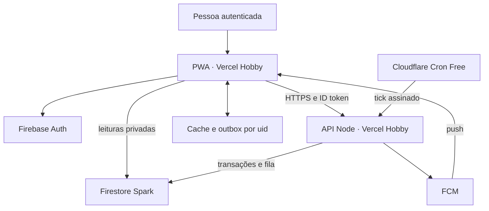
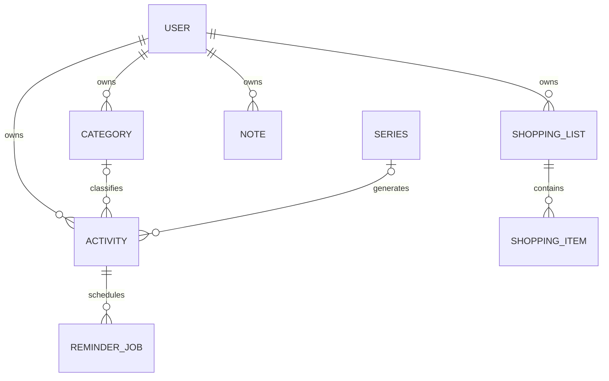
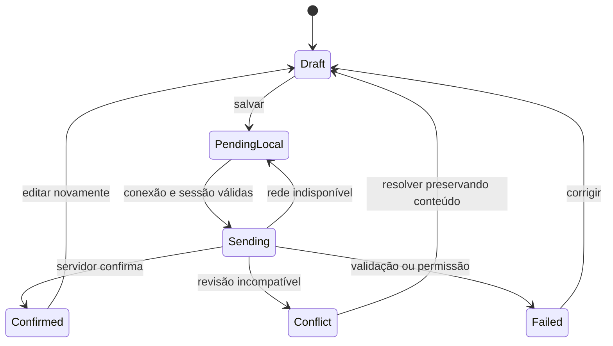

# Leve — Relatório completo de engenharia de software

**Versão 2.0 · 11 de setembro de 2026**  
**Responsável:** Kauan Kelvin · **Usuária de referência:** Gih

Especificação da descoberta à operação para transformar o protótipo Leve em agenda pessoal funcional, multiusuário por arquitetura e mantida em infraestrutura de custo zero dentro de franquias gratuitas.

> Este relatório comprova cobertura documental. Funcionalidade, capacidade, segurança e notificações só são consideradas aprovadas após implementação e execução dos testes indicados.

## Índice de seções

- 1. Como interpretar esta documentação
- 2. Visão do produto
- 3. Auditoria do protótipo real
- 4. Escopo de entrega
- 5. Requisitos funcionais
- 6. Requisitos não funcionais e metas de qualidade
- 7. Regras de negócio
- 8. Arquitetura de informação e telas
- 9. Design system: Vidro & Papel
- 10. Critério de aprovação de produto
- 11. Decisão arquitetural
- 12. Modelo de dados
- 13. Datas, fuso e recorrência
- 14. Contratos de aplicação e API
- 15. Persistência, offline e concorrência
- 16. Notificações e jobs sem plano pago
- 17. Segurança e privacidade
- 18. PWA, desempenho e atualização
- 19. Implantação e prevenção de 404
- 20. Operação, backup e custos
- 21. Registro de decisões arquiteturais
- 22. Convenções dos casos de uso
- 23. Estratégia de testes
- 24. Definição de pronto e homologação
- 25. Evidência existente versus pendente
- 26. Processo de desenvolvimento
- 27. Roadmap e backlog priorizado
- 28. Riscos e critérios de decisão
- 29. O que estudar e demonstrar em cada etapa
- 30. Prompt mestre para o Codex
- 31. Prompts de continuação por etapa
- 32. Orientações para revisar o trabalho do Codex
- 33. Fontes técnicas e limites de atualização
- 34. Baseline técnico auditado
- 35. Restrição de custo e alcance
- 36. Capacidade planejada
- 37. Admissão de contas
- 38. Degradação
- 39. Novos casos encontrados
- 40. Auditoria de cobertura
- 41. Limites honestos

---

# Leve — Produto, requisitos e design system

**Documentação de engenharia · versão 2.0 · 11 de setembro de 2026**  
**Responsável pelo projeto:** Kauan Kelvin. **Usuária de referência:** Gih.  
**Base analisada:** protótipo Leve, edição Glass. **Estado deste documento:** especificação proposta para implementação; não equivale a software entregue, homologação da usuária ou certificação de segurança.

## 1. Como interpretar esta documentação

Este conjunto transforma uma conversa de descoberta e um protótipo visual em uma especificação executável de produto. A implementação deve preservar a personalidade visual aprovada pelo desenvolvedor e validar a experiência com a usuária antes de fechar decisões que dependem dela.

Os documentos usam quatro classificações de origem:

- **Confirmado:** necessidade expressa na conversa ou comportamento diretamente observado no código.
- **Proposto:** decisão de engenharia para tornar essa necessidade implementável; pode ser ajustada com justificativa.
- **A validar:** preferência que a conversa não resolve. Há um padrão provisório para não paralisar o trabalho.
- **Fora da versão 1:** evolução possível, sem autorização implícita para ampliar o produto.

“100% funcional” significa que todos os requisitos obrigatórios da versão 1 passaram pelos critérios de aceite, incluindo falhas e recuperação. Não significa disponibilidade absoluta, ausência de bugs ou entrega pontual garantida de notificações por todos os sistemas operacionais.

### 1.1 Documentos e precedência

| Documento | Finalidade |
|---|---|
| 01-produto-requisitos-design.md | Problema, escopo, auditoria, requisitos e linguagem visual |
| 02-arquitetura-dados-operacao.md | Decisões técnicas, contratos, sincronização, segurança, implantação e operação |
| 03-casos-de-uso-e-testes.md | Fluxos completos, alternativas, exceções e matriz de verificação |
| 04-plano-e-prompt-codex.md | Etapas, backlog, aprendizado e instruções de execução para o Codex |
| 05-capacidade-e-revisao.md | Custo zero, admissão de contas, capacidade, novos casos e auditoria de cobertura |
| design-tokens.json | Tokens propostos para implementação, sem dependência de framework |
| referencia-prototipo/ | Cópia dos quatro arquivos efetivamente auditados |

Se um requisito conflitar com um exemplo de código, prevalece o requisito. Uma decisão posterior validada deve atualizar documento, testes e contrato juntos. O protótipo orienta a aparência; não prevalece sobre regras de segurança, acessibilidade e integridade.

## 2. Visão do produto

### 2.1 Problema real

A usuária registra obrigações de forma dispersa, inclusive no WhatsApp, e não mantém o hábito de consultar uma agenda física. Calendários isolados não atendem à necessidade de anotações; aplicativos mais amplos pareceram complicados, caros, limitados ou interrompidos por anúncios e etapas irrelevantes.

Ela relata que cores a ajudam a identificar e recordar informações. Isso é uma preferência de organização declarada, não um diagnóstico nem comprovação de um estilo cognitivo específico.

### 2.2 Proposta de valor

Uma agenda pessoal que reúne compromissos, tarefas, anotações e compras, com identificação visual consistente e acesso rápido no celular. O objetivo central é responder: **“O que preciso fazer e o que não posso esquecer?”**

### 2.3 Princípios que limitam o escopo

1. Abrir diretamente no dia atual depois da autenticação; não colocar uma landing page entre a usuária e a agenda.
2. Toda cor informativa deve acompanhar um nome, ícone ou estado textual.
3. Cadastrar uma tarefa comum exige título; a data vem preenchida com o dia selecionado. Horário é opcional para tarefas.
4. Campos avançados aparecem progressivamente; não transformar uma anotação em um formulário longo.
5. Não cobrar nem exibir anúncios. Infraestrutura obrigatoriamente em planos gratuitos sem cobrança por consumo ativada; franquias finitas exigem controle de capacidade e degradação explícita.
6. Não exigir meditação, exercícios, metas, sequências diárias, pontuação ou etapas para desbloquear a agenda.
7. Tratar anotações e compromissos como dados pessoais privados, mesmo que o endereço do aplicativo seja público.
8. Mostrar claramente quando algo está salvo apenas no aparelho e quando foi confirmado no servidor.
9. Preferir texto legível e desempenho ao efeito de vidro quando houver conflito.
10. Não usar inteligência artificial no produto para preencher necessidades que podem ser atendidas por controles simples.

### 2.4 Usuários e partes interessadas

| Papel | Necessidade | Responsabilidade |
|---|---|---|
| Gih, usuária piloto | Organização cotidiana no celular | Testar fluxos reais e dar feedback |
| Kauan, desenvolvedor e mantenedor | Construir, aprender e operar o produto | Implementação, segurança, custos e suporte |
| Outra pessoa com conta, se admitida no futuro | Própria agenda privada | Administrar seus dados; nunca acessar a agenda da Gih por padrão |
| Provedores de hospedagem e mensagens | Processar pedidos autenticados | Infraestrutura, conforme configuração e limites contratados |

Não há papel de administrador com acesso indiscriminado às notas dentro da interface da versão 1. O acesso operacional de quem controla a infraestrutura deve ser restrito e auditável.

### 2.5 Descoberta pendente, com padrões provisórios

| Pergunta para a usuária | Por que importa | Padrão proposto enquanto não respondida |
|---|---|---|
| Usa Android, iPhone ou ambos? Em quais navegadores? | Instalação e notificações dependem do dispositivo | Validar primeiro no aparelho real dela; não anunciar compatibilidade não testada |
| As cores representam categorias, dias ou ambos? | Evita atribuir significado errado à cor | Cor por categoria; seleção do dia tem estilo próprio |
| Quais categorias e cores ela escolheria? | Define reconhecimento visual | Estudos, Pessoal, Saúde e Casa & compras, todas editáveis |
| Precisa marcar o horário de início e término? | Distingue compromisso de tarefa | Compromisso com início/fim; tarefa com prazo opcionalmente horário |
| Quanto antes quer receber aviso? | Evita excesso de notificações | Nenhum aviso automático; opções 30 min, 1 h e 1 dia, mais personalizado |
| Quer apenas colorir a nota ou grifar trechos? | A conversa menciona grifar | Cor de papel + destaque de trechos em editor limitado |
| Lista do mês é sempre igual? | Reutilização e histórico | Modelo reutilizável e lista independente por mês |
| Usa computador compartilhado? | Cache local pode expor informações | Persistência offline só após escolher dispositivo pessoal |
| Quer semana começando segunda ou domingo? | Convenção de calendário | Segunda-feira, alterável em preferências |
| Custo e escala — confirmado pelo mantenedor | Uma usuária inicial, arquitetura para mais contas | R$ 0 de infraestrutura; admissão gradual conforme franquias e medições |

### 2.6 Validação inicial

Realizar uma sessão de 20–30 minutos com dados inventados: cadastrar uma entrega, mover o prazo, achar uma nota, grifar uma frase e comprar itens. Pedir que pense em voz alta, sem ensinar previamente onde clicar. Registrar ações, tempo aproximado, dúvidas e citações, sem inventar resultados. Ao final, perguntar o que ela abriria amanhã e o que removeria da tela.

Metas de produto propostas: localizar a próxima obrigação sem ajuda; cadastrar uma tarefa simples em até 30 segundos depois de aprender o fluxo; pelo menos quatro dos cinco cenários completados sem orientação. São critérios de piloto, não resultados já obtidos. Uma única usuária não sustenta conclusões estatísticas sobre o mercado.

## 3. Auditoria do protótipo real

### 3.1 Estrutura encontrada

O protótipo é uma aplicação estática: `index.html`, `style.css`, `glass.css` e `app.js`. O CSS Glass é carregado depois do estilo base e altera a aparência por cascata. O JavaScript mantém tarefas, notas, compras e cores em variáveis de memória. A navegação utiliza hashes: `#hoje`, `#agenda`, `#notas` e `#compras`.

Há escape de texto nos caminhos de renderização de conteúdo editável, formulários nativos, diálogo HTML, mensagens de feedback e uma tentativa opcional de registrar ferramenta WebMCP para listar atividades. Isso não torna o sistema persistente ou protegido por autenticação.

### 3.2 Inventário funcional e lacunas

| Área | Implementado no protótipo | Falta para uso real |
|---|---|---|
| Meu dia | Semana selecionável, tarefas por dia, contagem de pendências, atalho de criação | Data atual reagir à meia-noite; preferências da usuária; tarefas sem data; estados de rede |
| Calendário | Mês com 42 células, mês anterior/próximo, dia selecionado e filtro por categoria | Consultas persistentes por período, foco completo de teclado, eventos de vários dias e recorrência |
| Tarefas | Criar, editar, excluir e concluir; título, data, hora, categoria, descrição | Validação no servidor, distinção compromisso/tarefa, lixeira, histórico e sincronização |
| Lembretes | Seleção e rótulo demonstrativos | Agendamento no servidor, permissão, cadastro de aparelho, fila, cancelamento e diagnóstico |
| Notas | Criar, editar, excluir, texto simples e cor de papel | Grifo por trecho, autosave seguro, busca, vínculo com atividade e recuperação de conflito |
| Compras | Lista única, adicionar nome, marcar, remover e desmarcar todos | Várias listas, edição de quantidade, modelo do mês, cópia independente e histórico |
| Cores | Alterar cor de quatro categorias fixas | Criar/renomear/arquivar categorias, contraste e persistência |
| Identidade visual | Glassmorphism, serifas nos títulos, navegação flutuante, pastel | Consolidar tokens e eliminar nomes/estilos legados conflitantes |
| Responsividade | Regras CSS para desktop e celular | Homologação em aparelhos reais, teclado virtual, zoom e leitor de tela |
| Dados | Exemplos em arrays durante a sessão | Banco, conta, autorização, backup e exportação |
| Offline/PWA | Não implementados | Manifest, service worker, cache, fila local e política de atualização |
| Testes | Verificações isoladas executadas na revisão anterior | Testes de navegador, backend, autorização, notificações e recuperação |
| WebMCP | Consulta opcional de dados demonstrativos | Não é requisito da versão 1; remover ou proteger antes de usar dados reais |

### 3.3 Pontos específicos a corrigir na migração

- O nome Gih está fixo no HTML e nos títulos: substituir por nome do perfil.
- `today` é calculado uma vez: recalcular ao retornar à aba e na mudança de dia, respeitando o fuso do perfil.
- Tarefa com hora vazia é ordenada por string: definir seção própria “Sem horário”, depois das atividades com hora.
- As categorias têm chaves e nomes fixos: introduzir IDs estáveis e metadados editáveis.
- O resumo de compras mostra os primeiros itens, inclusive comprados: priorizar os pendentes.
- Desmarcar a lista inteira destrói seu estado histórico: na versão real, copiar para novo ciclo.
- O evento de vários dias não existe no modelo atual; uma data isolada não representa início e término.
- Exclusões usam comportamentos diferentes: unificar lixeira, desfazer e confirmação para remoção definitiva.
- A interface é reconstruída com `innerHTML`: migrar estado e componentes, preservando foco e rascunhos.
- O token `--purple` atualmente contém verde: renomear para `--action-primary` na base nova.
- A folha base ainda referencia Manrope e contém breakpoints antigos; a folha Glass referencia Instrument Serif. A versão final deve carregar apenas as famílias utilizadas e ter uma única escala responsiva.
- O calendário compacto pode truncar títulos: manter o texto completo na lista do dia e no nome acessível.
- A ferramenta WebMCP não é evidência de integração pronta; não a colocar como requisito comercial.

As falhas de certificado observadas antes foram da hospedagem Sites, não prova de defeito do HTML. O 404 relatado na Vercel não teve diagnóstico confirmado por logs; o novo projeto deve validar diretório de saída e rotas, sem repetir uma causa presumida como fato.

## 4. Escopo de entrega

### 4.1 Três marcos diferentes

| Marco | Conteúdo | Como apresentar |
|---|---|---|
| Protótipo atual | Exploração visual e interação temporária | “Demonstração; dados não persistem” |
| Beta funcional | Conta, dados privados persistentes, agenda, notas simples, compras, categorias, exportação e recuperação básica | Uso piloto online, com limitações publicadas |
| Versão 1 completa | Beta + recorrência, grifos, offline controlado, push validado, recuperação, acessibilidade e operação homologadas | Produto pronto dentro da matriz de suporte definida |

P0 = obrigatório no beta. P1 = obrigatório para fechar a versão 1 solicitada, mas implementado após o núcleo. P2 = evolução não contratada. Não chamar P1 de “opcional” apenas porque será desenvolvido depois.

### 4.2 Fora da versão 1

Rede social, feed, ranking, gamificação, IA generativa, voz, OCR, anexos de documentos, controle financeiro, integração bidirecional com calendários externos, compartilhamento de agendas, convites de reunião, aplicativos nativos de loja e edição colaborativa em tempo real. Tema escuro completo e editor de documentos extensos também ficam fora. A versão 1 terá preferência “reduzir transparência”; isso não exige tema escuro.

## 5. Requisitos funcionais

Os critérios resumidos abaixo são complementados por casos de uso e testes no documento 03. Todo dado deve pertencer à usuária autenticada; filtros de interface nunca substituem autorização.

| ID | Pri. | Requisito | Critério de aceite observável |
|---|---|---|---|
| RF-01 | P0 | Criar conta e entrar com Google ou e-mail/senha | Sessão real; cancelamento/erro de login explicados; nenhuma conta compartilhada |
| RF-02 | P0 | Recuperar acesso e sair | Recuperação por provedor; sair impede leitura da conta anterior |
| RF-03 | P0 | Editar perfil e preferências | Nome, locale, fuso IANA, início da semana e redução de transparência persistem |
| RF-04 | P0 | Criar tarefa | Título obrigatório; data opcional; horário só com data; confirmação persistente |
| RF-05 | P0 | Criar compromisso | Início/fim válidos ou intervalo de dias inteiros; erro se fim não for posterior |
| RF-06 | P0 | Editar, reagendar e concluir atividade | Mudança aparece no dia correto e em outro dispositivo após confirmação |
| RF-07 | P0 | Consultar dia, semana e mês | Seleção, retorno a Hoje, contadores e filtro consistentes |
| RF-08 | P0 | Mostrar pendências atrasadas e sem data | Atraso calculado corretamente; não muda o prazo silenciosamente |
| RF-09 | P1 | Repetir atividades | Diária, semanal e mensal com fim opcional; edição de uma ocorrência ou futuras |
| RF-10 | P0 | Administrar categorias | Criar, renomear, recolorir e arquivar sem perder atividades antigas |
| RF-11 | P0 | Criar, editar e organizar notas | Texto e título persistem; fixar uma nota para a tela inicial |
| RF-12 | P1 | Grifar e formatar notas de forma limitada | Negrito, listas e destaque; colagem segura; sem HTML arbitrário |
| RF-13 | P1 | Associar nota a atividade ou dia | Abrir a nota pelo contexto sem duplicar conteúdo; vínculo inválido tratado |
| RF-14 | P0 | Criar e editar listas de compras | Nome, itens, quantidade e unidade; editar item sem recriar lista |
| RF-15 | P0 | Marcar e remover itens | Contadores coerentes; remoção reversível; zero itens não causa divisão por zero |
| RF-16 | P1 | Reutilizar modelo de compras | Novo ciclo recebe itens desmarcados sem modificar lista anterior |
| RF-17 | P1 | Configurar lembrete por atividade | Antecedência ou horário absoluto; horários impossíveis rejeitados |
| RF-18 | P1 | Ativar/desativar notificações por aparelho | Permissão após ação explícita; revogação e token inválido tratados |
| RF-19 | P1 | Processar e abrir lembretes | Servidor agenda; clique abre atividade autenticada; edição invalida aviso anterior |
| RF-20 | P0 | Sincronizar dados online | Uma conta em dois aparelhos recebe a mesma versão confirmada |
| RF-21 | P1 | Consultar e alterar dados offline | Conjunto previamente carregado disponível; alterações ficam pendentes e são reconciliadas |
| RF-22 | P1 | Instalar e atualizar PWA | Manifest e shell offline válidos; atualização preserva rascunhos e operações pendentes |
| RF-23 | P0 | Excluir e restaurar conteúdo | Lixeira com prazo proposto de 30 dias; restaurar não recria notificações passadas |
| RF-24 | P0 | Exportar dados próprios | JSON versionado e legível contém todos os módulos, sem tokens ou credenciais |
| RF-25 | P1 | Importar exportação compatível | Validar, pré-visualizar, remapear IDs e evitar duplicação no reenvio |
| RF-26 | P0 | Excluir a própria conta | Reautenticação; encerramento de avisos; remoção verificável dos dados ativos |
| RF-27 | P1 | Buscar conteúdo pessoal | Escopo e limite informados; localizar título/texto sem carregar dados de terceiros |
| RF-28 | P0 | Separar demonstração e dados reais | Conta nova não recebe tarefas fictícias; demo não envia dados a produção |
| RF-29 | P0 | Exibir estado de gravação e erros | Nunca mostrar “salvo” antes da condição correspondente; oferecer tentar novamente |
| RF-30 | P1 | Resolver edições concorrentes | Notas conflitantes preservadas; escolha explícita sem sobrescrita silenciosa |
| RF-31 | P0 | Admitir múltiplas contas de forma controlada | Convite de uso único, conta verificada, limite global atômico; nenhum uid fixo |
| RF-32 | P0 | Tratar limites de consumo | Estado de quota/restrição claro; sem cobrança automática, descarte ou falsa confirmação |

## 6. Requisitos não funcionais e metas de qualidade

As metas abaixo são propostas de aceite. Medir em condições registradas; não confundir simulação local, emulador e ambiente real.

| ID | Tema | Meta / evidência |
|---|---|---|
| RNF-01 | Isolamento | Testes cruzados A/B negam leitura e alteração; inclusive exportação, busca e funções |
| RNF-02 | Integridade | Repetir a mesma operação não duplica entidades; revisionamento rejeita atualização incompatível |
| RNF-03 | Acessibilidade | Alvo WCAG 2.2 AA; testes automáticos + teclado + leitor de tela nos fluxos principais |
| RNF-04 | Leitura | Conteúdo principal 16 px ou mais; rótulos frequentes 14 px; metadados 12–13 px; controles tocáveis 44 px como padrão de produto |
| RNF-05 | Desempenho web | Alvo de campo no percentil 75: LCP ≤ 2,5 s, INP ≤ 200 ms e CLS ≤ 0,1; antes de tráfego, usar medições laboratoriais sem alegar resultado de campo |
| RNF-06 | Resposta percebida | Feedback local em até 100 ms como objetivo; mostrar pendência imediatamente se houver rede lenta |
| RNF-07 | Sincronização | Alvo do piloto: confirmação e atualização em segundo aparelho em até 5 s no p95 de rede estável; registrar latência separada de offline |
| RNF-08 | Disponibilidade | Objetivo inicial 99,5% mensal para funções essenciais, medido após lançamento; não garantia contratual |
| RNF-09 | Recuperação | Exportação/importação ensaiada; RPO igual à idade do último arquivo íntegro disponível; sem promessa de backup diário ou RTO fixo |
| RNF-10 | Compatibilidade | Matriz aprovada no piloto; documentar versão/SO/navegador de cada teste; acesso sem push continua utilizável |
| RNF-11 | Manutenibilidade | TypeScript estrito; módulos por domínio; regras puras fora de componentes; migrações e contratos versionados |
| RNF-12 | Privacidade operacional | Logs não contêm títulos, notas, tokens ou lista de compras; telemetria mínima e documentada |
| RNF-13 | Custo | Limites de payload, paginação, número de inscrições ativas e orçamento monitorado |
| RNF-15 | Capacidade | Validar envelope de 50 contas cadastradas e 20 ativas/dia com margem de franquias; hipótese, não resultado medido |
| RNF-16 | Restrição financeira | Vercel Hobby, Firebase Spark e Workers Free sem faturamento por consumo; nenhum upgrade automático |
| RNF-14 | Atualização segura | Novo frontend suporta schema atual/anterior durante transição; nenhuma atualização força perda de outbox |

As metas de Core Web Vitals seguem a referência primária [Web Vitals](https://web.dev/articles/vitals). As escolhas de tamanho de fonte e controles acima são padrões internos. Os critérios normativos de contraste, foco, reflow e alternativas à cor devem ser avaliados pela [WCAG 2.2](https://www.w3.org/TR/WCAG22/).

## 7. Regras de negócio

| ID | Regra proposta |
|---|---|
| RN-01 | Toda entidade privada pertence a exatamente um uid; não existe acesso pela simples posse da URL. |
| RN-02 | Título de atividade: 1–120 caracteres após trim; título de nota: 1–100; categoria: 1–40; item de compra: 1–100. Validar no cliente e servidor. |
| RN-03 | Tarefa pode não ter data. Compromisso exige intervalo. Horário isolado sem data é inválido. |
| RN-04 | Status persistidos: pending, completed, canceled. “Atrasada” é estado derivado, não um quarto status mutável. |
| RN-05 | Tarefa com dia, sem hora, vence ao fim desse dia no fuso da atividade. Uma tarefa sem data nunca fica atrasada automaticamente. |
| RN-06 | Compromisso passado aparece como passado; não concluir automaticamente como tarefa. Cancelamento não equivale a conclusão. |
| RN-07 | Cor de categoria pode mudar sem mudar status. “Saúde” não implica urgência, diagnóstico ou tratamento especial. |
| RN-08 | Arquivar categoria impede novos vínculos, preserva os existentes. Categoria ausente aparece como “Sem categoria”, nunca quebra a tela. |
| RN-09 | Concluir atividade cancela lembretes ainda não enviados; reabrir só reativa avisos futuros válidos. |
| RN-10 | Uma ocorrência recorrente tem identidade estável baseada na série e no instante/data local original, não no horário editado. |
| RN-11 | Para recorrência mensal em dia inexistente, padrão: usar último dia do mês. Mostrar essa regra na criação; alternativa de pular exige escolha explícita. |
| RN-12 | Alterar série “a partir desta” preserva histórico. A operação separa a série e invalida futuras ocorrências da versão anterior. |
| RN-13 | Compra mensal é uma cópia de um modelo; editar a cópia não altera o modelo nem os meses anteriores. |
| RN-14 | Quantidade é opcional; se numérica, deve ser positiva. Unidade é enum com opção “outra” e rótulo curto. Não fazer cálculo financeiro. |
| RN-15 | Até 3 lembretes por atividade é limite inicial de proteção, sem paywall. Mesma antecedência não pode aparecer duas vezes. |
| RN-16 | Conta em exclusão não recebe novas operações nem notificações; trabalhos pendentes tornam-se inertes. |
| RN-17 | Notas conflitantes não se mesclam automaticamente. Preservar rascunho local e versão remota até a usuária resolver. |
| RN-18 | Importação nunca substitui tudo por padrão; exibir resumo e criar novos IDs, mantendo relacionamentos. |
| RN-19 | Lixeira de 30 dias; após prazo, remoção automática paginada quando a rotina estiver operacional. Remoção antecipada exige confirmação. Não prometer expurgo no segundo exato; aparelhos reconectados recebem a exclusão. |
| RN-20 | Operação pendente não está confirmada remotamente. Dados confirmados só constam da recuperação pessoal após exportação íntegra; sincronização não é backup. |

## 8. Arquitetura de informação e telas

### 8.1 Navegação

Preservar quatro destinos primários: Meu dia, Calendário, Notas e Compras. Configurações, notificações, lixeira e exportação ficam no menu de perfil; não ampliar a barra inferior com mais ícones. O beta tem telas de entrar, recuperar acesso e completar perfil. O cadastro deve ser curto e não incluir tour obrigatório.

Rotas propostas: `/hoje`, `/calendario`, `/notas`, `/notas/:id`, `/compras`, `/compras/:id`, `/atividade/:id`, `/configuracoes`, `/lixeira`, `/entrar`, `/recuperar` e `/demo`. Usar query string para dia/filtro quando isso permitir voltar e compartilhar contexto interno; o servidor ainda verifica propriedade.

### 8.2 Contratos das telas

| Tela | Informação principal | Ações principais | Estados especiais |
|---|---|---|---|
| Meu dia | Data, semana, atividades ordenadas, pendências e nota fixada | Criar, concluir, editar, selecionar dia | Sem atividades; virada do dia; offline; tarefa pendente de envio |
| Calendário | Mês e resumo do dia selecionado | Mudar mês, Hoje, filtrar, abrir/criar atividade | Carregando mês; conteúdo não baixado; muitos eventos; seleção por teclado |
| Notas | Notas recentes/fixadas, busca e papel colorido | Criar, editar, grifar, vincular, arquivar | Rascunho; salvando; salvo local; conflito; nota excluída em outro aparelho |
| Compras | Lista ativa, itens pendentes, comprados recolhíveis | Adicionar, editar, marcar, novo ciclo | Lista vazia; lista arquivada; item duplicado; reutilização |
| Atividade | Título, tipo, data, hora, categoria, descrição e lembrete | Editar, concluir/cancelar, repetir, excluir | Série recorrente; excluída; acesso negado; horário inválido |
| Configurações | Conta, fuso, cores, acessibilidade e aparelhos | Salvar preferências, instalar, exportar, sair | Permissão negada; aparelho compartilhado; alteração de fuso |
| Lixeira | Conteúdo removido e dias restantes | Restaurar, excluir definitivamente | Vazio; prazo expirado; vínculo com entidade já removida |

### 8.3 Comportamentos transversais

- Skeleton apenas durante carregamento real; nunca esconder erro sob carregamento infinito.
- Estado vazio com ação contextual: “Nenhuma atividade neste dia” + “Adicionar atividade”.
- Erro de rede preserva o rascunho e oferece repetição; erro de validação aponta o campo.
- Não enviar nova operação em cada clique repetido no botão enquanto a mesma operação está pendente.
- Diálogo fecha com Escape; clique fora não descarta rascunho sem tratamento.
- Em celular, formulários longos usam folha de edição que respeita teclado e safe area; botão salvar permanece alcançável.
- Acesso negado usa mensagem genérica: “Não foi possível abrir este item”; não revela a existência de dados alheios.
- Histórico de navegação volta ao período/filtro anterior, não reinicia sempre em Hoje.

## 9. Design system: Vidro & Papel

### 9.1 Direção visual

A identidade combina uma estrutura leve de vidro fosco com conteúdos estáveis, semelhantes a cartões e folhas. A translucidez fica no suporte: sidebar, navegação móvel, painéis e diálogo. Campos, texto de notas e rótulos críticos precisam de uma superfície suficientemente opaca. Não usar blur animado, brilho passando pela tela, reflexos intensos, cartões 3D ou fundos em movimento.

O refinamento deve vir da composição, proporção, espaço e consistência. Evitar adicionar frases motivacionais, ícones decorativos repetidos ou grandes áreas vazias para fazer o produto parecer sofisticado.

### 9.2 Tipografia: encontrada e proposta

| Uso | Encontrado na edição Glass | Especificação final |
|---|---|---|
| Interface e corpo | DM Sans | DM Sans 400, 500 e 600; 700 somente em ênfase necessária |
| Marca e títulos de página | Instrument Serif, regular e itálico | Instrument Serif 400; itálico moderado, nunca em parágrafos funcionais |
| Fontes legadas | Manrope importada pelo CSS base | Remover se não houver uso intencional após migração |
| Fallback | Sans-serif e Georgia | `DM Sans, system-ui, sans-serif`; `Instrument Serif, Georgia, serif` |
| Numerais de horário | Tabulares no CSS Glass | Manter `font-variant-numeric: tabular-nums` |

| Token | Tamanho | Peso/linha | Uso |
|---|---|---|---|
| type.display | clamp(2.75rem, 4vw, 3.7rem) | 400 / 1.08 | Título principal desktop |
| type.display.mobile | 2.8rem | 400 / 1.1 | Página móvel; permitir quebra em 320 px |
| type.noteTitle | 2rem | 400 / 1.15 | Título de nota |
| type.dialogTitle | 2–2.25rem | 400 / 1.1 | Diálogos |
| type.section | 1.125rem | 600 / 1.4 | Cabeçalho de seção |
| type.body | 1rem | 400 / 1.5–1.75 | Conteúdo e título de tarefa |
| type.label | 0.875rem | 500 / 1.4 | Campos, botões e categorias frequentes |
| type.meta | 0.75–0.8125rem | 400 / 1.4 | Metadados secundários |

Rótulos frequentes da navegação móvel atualmente aparecem em 12 px: elevar para 14 px na versão final, mesmo que exija abreviar “Minhas notas” para “Notas”. Metadados não devem carregar a única informação de prazo. Não há exigência normativa de tamanho de fonte em pixels na WCAG; os valores são decisões de produto.

Preferir fontes WOFF2 hospedadas com o próprio aplicativo, com licença correspondente preservada e `font-display: swap`. Usar subconjunto que inclua português e acentos. Pré-carregar apenas arquivos realmente críticos; reservar espaço para minimizar mudança de layout.

### 9.3 Paleta e significados

| Token semântico | Valor base | Uso |
|---|---|---|
| color.canvas | #EDF0ED | Fundo geral |
| color.text | #303B3A | Texto principal |
| color.textMuted | #626D69 | Texto secundário |
| color.action | #4D685C | Botão principal |
| color.actionHover | #3E594D | Hover/pressed |
| color.focus | #557967 | Anel de foco |
| color.glass | rgba(255,255,255,0.68) | Painéis sobre o fundo pastel |
| color.field | rgba(255,255,255,0.87) | Campos legíveis |
| color.border | rgba(83,105,89,0.13) | Separadores |
| color.danger | #8B5252 | Ações destrutivas, com texto/ícone |
| color.success | #385649 | Confirmação, com texto/ícone |
| color.warning | #77551F | Aviso de pendência, proposto e sujeito a contraste |

| Categoria inicial | Cor de identificação | Fundo do cartão |
|---|---|---|
| Estudos | #A08AC2 | #EEE8F6 |
| Pessoal | #D6A283 | #FAEDE4 |
| Saúde | #86A5C6 | #EAF0F8 |
| Casa & compras | #8EAA8E | #EAF2E9 |

Papéis de nota: manteiga `#FBF4DF`, lavanda `#EEE8F6`, verde `#EAF2E9`, pêssego `#FAEDE4`, azul `#EAF0F8`. São presets iniciais; não determinam urgência. As cores de status não podem reutilizar automaticamente a cor escolhida pela categoria.

Ao permitir uma cor arbitrária, calcular o fundo derivado e escolher texto com contraste suficiente. Nunca usar a cor escolhida diretamente como texto de 14 px. Validar contraste do resultado composto com transparência, não apenas do hexadecimal isolado. Alvos: texto comum 4,5:1, texto grande 3:1, indicadores não textuais relevantes 3:1, conforme aplicabilidade da [WCAG 2.2](https://www.w3.org/TR/WCAG22/). A paleta registrada ainda precisa desse ensaio visual em todas as combinações.

### 9.4 Material, elevação e forma

| Elemento | Receita proposta |
|---|---|
| Painel de vidro | Branco 68%; borda branca ~90%; blur 22 px; sombra baixa; texto escuro |
| Sidebar | Branco 68%; blur 26 px; saturação 115%; raio 26 px |
| Navegação móvel | Fundo #F4F8F1 com ~87%; blur 24 px; raio 23 px; respeitar safe area |
| Diálogo | #F7FAF4 com ~93%; blur 30 px; fundo externo escurecido ~24%; raio 25 px |
| Nota | Fundo pastel predominantemente opaco; raios 4/20/20/20 px; sombra suave |
| Campo | Fundo branco ~87%; borda cinza-esverdeada; raio 10 px |
| Tarefa | Fundo pastel; raio 13 px; horário em coluna independente |

Sombra base do protótipo: `0 12px 38px #425e4a08, inset 0 1px 0 #fff`. Não acumular blur em várias camadas aninhadas. Em aparelhos lentos ou preferência de transparência reduzida, usar superfície sólida `#F9FAF7`. A preferência interna deve funcionar mesmo quando a media query de transparência não for suportada.

### 9.5 Espaçamento e layout

Escala proposta em pixels: 4, 8, 12, 16, 20, 24, 32, 40, 48 e 64. Converter para rem quando fizer sentido; não usar alturas rígidas para conteúdo textual. Distância entre rótulo e campo: 8; entre campos: 16; entre seções: 24–32. Containers internos com `min-width: 0`; textos longos com quebra segura.

| Faixa final | Layout |
|---|---|
| 320–739 px | Uma coluna; navegação inferior; mínimo de 18 px nas laterais; calendário com lista do dia sempre disponível |
| 740–999 px | Sidebar compacta; agenda em uma coluna; módulos auxiliares podem ocupar duas colunas |
| 1000–1199 px | Agenda + lateral de aproximadamente 264 px quando houver espaço real |
| 1200 px ou mais | Sidebar 220 px; coluna auxiliar 300–340 px; conteúdo com limite de largura |

Os breakpoints são regras propostas de consolidação, não um inventário de todos os estilos legados. Testar 320, 360, 390, 768, 1024 e 1440 px, orientação paisagem e zoom. A barra inferior não pode cobrir o último item nem o botão salvar quando o teclado abrir.

### 9.6 Componentes e contratos

| Componente | Variantes / estados | Contrato de interação |
|---|---|---|
| AppShell | desktop, móvel, sem transparência | Destino ativo identificável; navegação não perde rascunho |
| Button | primary, secondary, text, destructive; loading/disabled | Alvo 44 px; rótulo acessível; loading evita envio duplicado |
| ActivityCard | tarefa, compromisso, pendente local, concluída, cancelada | Checkbox só para ação coerente; abrir edição pelo título; hora fora do cartão |
| DayPicker | atual, selecionado, com atividades | Data atual e seleção não confundidas; teclado e leitura completa |
| MonthGrid | carregando, vazio, completo, parcial offline | Teclas direcionais, Home/End, mudança de mês; lista alternativa |
| CategoryChip | ativo, inativo, arquivado | Nome + cor; estado por borda/texto e não só preenchimento |
| NoteCard | normal, fixada, rascunho, conflito | Título completo disponível; editar e excluir com ações separadas |
| NoteEditor | leitura/edição; salvando/local/salvo/erro | Toolbar curta, sem HTML livre; preserva seleção e rascunho |
| ShoppingItem | pendente, comprado, pendente local | Área do rótulo marca; botão excluir não marca por acidente |
| Dialog/Sheet | aberto, inválido, salvando | Foco contido, Escape, retorno ao acionador, título acessível |
| StatusNotice | offline, conflito, erro, atualização | Persistente se exige ação; toast só para feedback transitório |
| EmptyState | sem registros, sem resultado, não baixado | Mensagem distinta para cada causa; nunca confundir offline com vazio |

### 9.7 Microinterações e conteúdo

Duração proposta: 150–220 ms; deslocamento máximo de entrada 4 px; animação de opacidade e transform, não de blur. Desativar efeitos não essenciais em redução de movimento. Não vibrar, tocar som ou lançar confete automaticamente.

Mensagens exemplares: “Salvo”, “Salvo neste aparelho. Vamos sincronizar quando houver internet”, “Esta nota mudou em outro aparelho”, “Notificações desativadas neste navegador”. Evitar “Tudo sincronizado” se existe qualquer comando pendente. Evitar mensagens de sucesso genéricas quando uma ação falhou parcialmente.

### 9.8 Acessibilidade e critérios de revisão visual

- Usar elementos semânticos, títulos ordenados, landmarks, labels reais e links para navegação.
- Garantir ordem de tabulação previsível e foco visível não encoberto pela barra fixa.
- Conteúdo acessível a 200% de zoom e reflow equivalente a 320 CSS px; calendário tem alternativa em lista.
- Anunciar alterações relevantes com região live discreta; não reler a página inteira a cada checkbox.
- Estados concluídos continuam legíveis; não depender de opacidade excessivamente baixa.
- Ícones decorativos com `aria-hidden`; botões de ícone com nome específico.
- Confirmar TalkBack ou VoiceOver no aparelho alvo; testes automatizados não substituem uso real.
- Não declarar conformidade antes de registrar a avaliação e corrigir os problemas encontrados.

## 10. Critério de aprovação de produto

A versão 1 só pode ser aceita quando a usuária consegue realizar os casos prioritários, os testes de isolamento e recuperação passam, os lembretes foram ensaiados no dispositivo suportado e as limitações restantes estão registradas. A assinatura de aceite deve indicar versão, data, ambiente e quais cenários foram executados. Aprovar cores ou aparência não equivale a aprovar sincronização, segurança ou custo.


---

# Leve — Arquitetura, dados, segurança e operação

## 11. Decisão arquitetural

### 11.1 Arquitetura recomendada — versão 2.0
Frontend React/TypeScript/Vite PWA; frontend e API HTTP Node.js na Vercel Hobby; Firebase Authentication e Firestore Standard no Spark sem faturamento; FCM para web; um Cloudflare Worker Free com Cron Trigger por minuto, que apenas chama uma rota interna autenticada da API Vercel. A fila durável fica no Firestore.

Não usar Firebase Cloud Functions, Cloud Tasks, Google Cloud Scheduler, Storage, TTL/PITR/backup gerenciado, Blaze, trials com conversão paga ou domínio comprado. Vercel Functions e Firebase Cloud Functions são produtos distintos. A primeira está na franquia Hobby proposta.

Esta revisão substitui a sugestão conversacional de escrita direta pelo cliente: manter comandos no backend gratuito preserva validação completa de notas, recibos e conflitos. Provar a integração real desses planos antes da liberação; esta documentação não representa um teste executado.

### 11.2 Por que esta escolha

| Alternativa | Benefício | Custo ou limitação | Decisão |
|---|---|---|---|
| HTML/JS atual + armazenamento local | Pouco trabalho inicial | Sem conta, backup remoto ou sincronização confiável | Referência visual, não base final de dados |
| React/Vite + Firebase | SPA simples, identidade, consultas em tempo real e backend gerenciado | Franquias finitas, segurança e dependência do provedor | Proposta para versão 1 |
| React + PostgreSQL/Supabase | Modelo relacional e SQL expressivo | Outra implementação de sincronização/offline e notificações | Alternativa se houver preferência explícita por SQL |
| React + Spring Boot + PostgreSQL | Excelente exercício de backend e controle do domínio | Mais implantação, autenticação, operação e infraestrutura | Trilha futura de aprendizado; não desenvolver dois backends agora |
| Next.js com SSR | Renderização no servidor e páginas públicas | Pouco benefício imediato para agenda privada sem SEO | Não necessário para a necessidade atual |

O ponto de maior complexidade não é React: é combinar sincronização, edição concorrente, recorrência e avisos. Por isso esses mecanismos têm contratos específicos em vez de serem presumidos como benefícios automáticos do provedor.

### 11.3 Restrição financeira
R$ 0 de mensalidade de infraestrutura, nenhuma cobrança por consumo ativada. Não vincular Cloud Billing. Usar subdomínios gratuitos e emuladores no desenvolvimento. Não criar múltiplas contas para contornar franquias. Custos pessoais de conexão, equipamento e tempo não estão incluídos nesta definição.

Uma usuária inicialmente; múltiplas contas isoladas por uid desde o primeiro commit. Admissão controlada por convite; planejamento de 50 contas cadastradas e até 20 ativas/dia, condicionado a medições, não promessa de capacidade. Limites e critérios de expansão estão no documento 05.

A [Vercel Hobby](https://vercel.com/docs/plans/hobby) restringe uso a projetos pessoais não comerciais. O [Firebase Spark](https://firebase.google.com/docs/projects/billing/firebase-pricing-plans) tem franquias sem faturamento. Ao esgotar, preservar dados e degradar explicitamente, sem upgrade. Reavaliar planos se os termos mudarem ou o produto se tornar comercial.

### 11.4 Contexto e containers



Escritas de domínio passam exclusivamente pela API. Firebase Admin existe somente no servidor; Worker de cron conhece apenas URL fixa e segredo HMAC. O cache Firestore é de leitura, a outbox é a única fila de escrita. Não duplicar gravação offline pelo SDK.

Jobs longos persistem cursor e retornam 202; não depender de processo infinito nem de trabalho depois de retornar resposta.

### 11.5 Módulos e dependências

| Módulo | Responsabilidade | Não deve fazer |
|---|---|---|
| identity | Entrar, sair, perfil e sessão | Armazenar senha ou token de serviço manualmente |
| activities | Tarefas, compromissos, datas, estado | Enviar push dentro de componente React |
| recurrence | Regras, ocorrências e exceções | Gerar infinitamente a série |
| notes | Editor limitado, rascunho e conflito | Renderizar HTML livre recebido do usuário |
| shopping | Listas, itens e modelos | Alterar lista antiga ao criar novo mês |
| categories | Identidade visual das classificações | Inferir prioridade a partir de cor |
| sync | Cache, outbox e reenvio | Sobrescrever conflitos sem autorização |
| notifications | Preferências, dispositivos, jobs | Prometer entrega no segundo exato |
| account-data | Exportação, importação e exclusão | Expor credenciais ou dados de outra conta |

Estrutura proposta do repositório, descrita por caminhos:

| Caminho | Conteúdo |
|---|---|
| apps/web/src/app | Rotas, shell, providers e tratamento de erro |
| apps/web/src/features/{modulo} | Componentes, hooks e adaptadores de cada domínio |
| apps/web/src/components/ui | Primitivas acessíveis e componentes do design system |
| apps/web/src/styles | Tokens e composição visual consolidada |
| apps/web/src/platform | Firebase, service worker, IndexedDB e telemetria |
| packages/domain/src | Tipos, validadores e regras puras, sem dependência de navegador |
| server/commands | Casos de uso do backend |
| server/jobs | Lembretes, reconciliação, limpeza e exclusão |
| server/repositories | Acesso ao Firestore e transações |
| api/commands.ts, api/internal/tick.ts | Entradas HTTP Vercel para server/ |
| workers/scheduler/src | Agendador mínimo Cloudflare Free |
| tests/unit, tests/integration, tests/e2e | Testes separados por objetivo |
| docs/adr | Decisões e consequências |
| docs/runbooks | Procedimentos operacionais |
| firestore.rules, firestore.indexes.json | Autorização e índices versionados |

Usar workspace simples do gerenciador de pacotes escolhido. Não introduzir Turborepo, Kubernetes, gateway próprio ou serviço de eventos distribuído para justificar essa estrutura.

### 11.6 Bibliotecas e política de versões

- React e TypeScript para interface e contratos; Vite para build.
- React Router para URLs reais e retorno ao contexto.
- Biblioteca de formulários e validação compartilhada, por exemplo React Hook Form + Zod; validar compatibilidade no bootstrap.
- Primitivas acessíveis, por exemplo Radix/shadcn, adaptadas aos tokens do Leve; não copiar tema padrão.
- Editor limitado baseado em Tiptap/ProseMirror ou equivalente mantido. Escolher um, com schema explícito; não implementar editor rich text manual.
- Biblioteca consolidada de datas/fusos e recorrência: selecionar em uma prova pequena que cubra os casos da seção 13; evitar operações de calendário por milissegundos.
- Vitest, Testing Library e Playwright para as camadas correspondentes; Firebase Emulator Suite para Auth/Firestore e API HTTP local.
- Service worker único integrado ao processo de build. Evitar registrar workers concorrentes no mesmo escopo.

Não fixar neste relatório números de versões que envelheçam antes do início. Na fase 0, escolher versões estáveis compatíveis, registrar versão do Node, commit do lockfile e data da seleção. Não usar dependência `latest` sem lockfile reproduzível. Revalidar guias oficiais ao implementar APIs específicas.

## 12. Modelo de dados

### 12.1 Convenções gerais

- IDs opacos e estáveis; preferencialmente UUID para entidades geradas no cliente offline.
- `uid` do proprietário vem da autenticação, não de um campo confiado ao cliente.
- `createdAt` e `updatedAt` são instantes de servidor; `clientCreatedAt` é metadado opcional, nunca autoridade para conflito.
- `schemaVersion` inteiro em entidades persistentes e arquivos exportados.
- `revision` inteiro monotônico, iniciado em 1; alterações aceitas incrementam uma vez.
- `deletedAt` nulo ou timestamp marca exclusão lógica; `purgeAfter` é preenchido pelo servidor.
- Campos opcionais usam convenção única de null ou ausência, definida no schema; não misturar as duas sem adaptador.
- Datas civis são strings ISO `YYYY-MM-DD`; horários civis `HH:mm`; instantes são timestamps UTC.
- Referências entre entidades são sempre verificadas dentro do mesmo usuário.

### 12.2 Coleções propostas

| Caminho | Registro | Leitura do cliente | Escrita do cliente |
|---|---|---|---|
| users/{uid} | Perfil, conta ativa/em exclusão, preferências básicas | Próprio usuário | Não; por comando |
| users/{uid}/categories/{id} | Nome, cor, ordem, arquivamento | Próprio usuário | Não |
| users/{uid}/activities/{id} | Tarefa ou compromisso; avulso ou ocorrência | Próprio usuário | Não |
| users/{uid}/series/{id} | Recorrência e template | Próprio usuário | Não |
| users/{uid}/notes/{id} | Nota e metadados | Próprio usuário | Não |
| users/{uid}/shoppingLists/{id} | Lista e ciclo/modelo | Próprio usuário | Não |
| users/{uid}/shoppingLists/{id}/items/{id} | Item de compra | Próprio usuário | Não |
| users/{uid}/notificationDevices/{id} | Metadados seguros do aparelho | Próprio usuário | Não |
| notificationTokens/{uid_deviceId} | Token FCM e metadados de envio | Nunca | Nunca |
| users/{uid}/inbox/{id} | Avisos internos e estados consultáveis | Próprio usuário | Não |
| commandReceipts/{uid_operationId} | Recibo de idempotência | Nunca diretamente | Nunca |
| reminderJobs/{jobId} | Intenção de envio, estado e versão esperada | Nunca | Nunca |
| maintenanceJobs/{id} | Exclusões, importações e exportações maiores | Nunca | Nunca |
| memberships/{uid} | Admissão, suspensão e limites da conta | Próprio estado sanitizado | Nunca |
| invites/{id} | Hash, validade, e-mail permitido e consumo | Nunca | Nunca |
| serviceControls/global | Admissões e modo de degradação | Resumo sanitizado pela API | Nunca |
| usageBuckets/{uid_period} | Limites de comandos e bulk | Resumo próprio pela API | Nunca |

Não criar regra recursiva de leitura para qualquer caminho abaixo de `users/{uid}` sem considerar futuros documentos internos. Permitir explicitamente as coleções de produto. Tokens sensíveis ficam fora dos documentos retornados à interface.

### 12.3 Entidades de domínio

**UserProfile:** displayName, locale (`pt-BR`), timeZone IANA, weekStartsOn (`1` inicialmente), reduceTransparency, trustedDevicePreference local ao aparelho, pinnedNoteId opcional, activeShoppingListId opcional, accountState (`active|deleting`), schemaVersion, revision e timestamps. A indicação de dispositivo confiável deve ser local; não habilitar cache automaticamente em todos os aparelhos por mudar uma preferência no perfil.

**Category:** name, colorHex, sortOrder, archivedAt, revision, timestamps. O fundo é derivado pela função de design; se persistido, deve ser gerado e validado no servidor, nunca aceito como CSS arbitrário.

**Activity — campos comuns:** kind (`task|event`), title, descriptionPlain, categoryId ou null, status, completedAt/canceledAt, seriesId ou null, occurrenceKey ou null, seriesRevision ou null, reminderSpecs, revision, schemaVersion, deletedAt e timestamps.

**TaskSchedule:** dueDate ou null, dueTime ou null, timeZone, dueAt ou null. Sem horário, `dueAt` pode permanecer nulo e o prazo é a data civil inteira. Com horário, o servidor calcula dueAt. O perfil decide como exibir um instante em outro fuso, mas não deve reinterpretar a data civil de tarefa sem hora.

**EventSchedule:** allDay boolean. Se falso: startsAt, endsAt, timeZone; guardar também a representação civil de origem para edição. Se verdadeiro: startDate e endDateExclusive, sem converter dias inteiros em horários UTC arbitrários. O tipo do schema impede os dois formatos ao mesmo tempo. `endsAt > startsAt`; para dia inteiro, `endDateExclusive > startDate`.

**RecurrenceSeries:** template de atividade, frequency (`daily|weekly|monthly`), interval de 1–365 conforme frequência, weekdays para semanal, monthDay para mensal, monthlyOverflow (`lastDay|skip`), startsOn, endMode (`never|until|count`), until ou count, timeZone, seriesRevision, active, materializedRanges e timestamps. Limites de tela/API impedem expansão infinita.

**Occurrence:** é um Activity persistido. occurrenceKey usa série + data/hora civil original; mover uma ocorrência não muda a chave. Campos de exceção: originalSchedule, overriddenFields e excluded. O histórico concluído é preservado quando a série muda.

**Note:** title, bodyDoc como JSON de schema limitado, plainText derivado para busca, paperColorPreset, pinned, linkedActivityIds (máximo inicial de 20), linkedDate ou null, revision, deletedAt e timestamps. Limites iniciais: 20 mil caracteres de texto e 100 KiB para o documento serializado. Validar nós, marcas, profundidade e tamanho. Não é editor de relatórios extensos.

**ShoppingList:** title, listKind (`regular|template|cycle`), sourceTemplateId ou null, cycleKey (`YYYY-MM` quando aplicável), archivedAt, revision, deletedAt e timestamps. Uma lista pode existir sem modelo. Templates não têm estado de compra significativo.

**ShoppingItem:** name, quantityValue opcional, unit (`un|kg|g|l|ml|pacote|duzia|outra`), unitLabel se outra, detail opcional, checked, checkedAt, sortOrder, revision e timestamps. Não juntar itens de mesmo nome automaticamente: “frango para o almoço” pode não ser o mesmo item da compra mensal.

**NotificationDevice:** deviceId opaco, displayName informado, permissionState, enabled, lastSeenAt, lastTestAt e tokenState. Evitar fingerprint invasivo; nome do dispositivo é conveniência. Token real fica na coleção protegida.

**ReminderJob:** uid, activityId, activityRevision, seriesRevision opcional, reminderSpecId, scheduledAt, deliveryWindowEnd, state (`pending|processing|accepted|canceled|failed|unknown|expired`), attempts, leaseUntil, lastErrorCode, providerMessageId opcional, timestamps. Estados por dispositivo podem ficar em subcoleção interna.

### 12.4 Relações principais



As relações não são foreign keys automaticamente impostas pelo Firestore. A aplicação deve validá-las e tratar arquivamento/exclusão. O diagrama é conceitual; `SERIES` e `REMINDER_JOB` também carregam propriedade por uid.

### 12.5 Consultas e índices

Não carregar o banco inteiro ao abrir o calendário. O intervalo é calculado no fuso de visualização e as consultas são limitadas ao usuário. Separar os tipos de agenda, mesclar e ordenar na camada de aplicação:

1. Tarefas com instante: dueAt dentro da janela UTC da visualização.
2. Tarefas só com data: dueDate dentro da janela de datas civis.
3. Compromissos com hora: startsAt antes do fim e endsAt depois do início; incluir eventos que atravessam a meia-noite.
4. Compromissos de dia inteiro: startDate antes do fim e endDateExclusive depois do início.
5. Tarefas sem data: consulta separada e paginada, nunca espalhada por todos os dias.

Índices compostos iniciais a derivar das queries reais: activities(kind, deletedAt, dueAt); activities(kind, deletedAt, dueDate); activities(kind, deletedAt, startsAt, endsAt); activities(kind, deletedAt, startDate, endDateExclusive); notes(deletedAt, updatedAt desc); shoppingLists(archivedAt, updatedAt desc); reminderJobs(state, scheduledAt). Consultas adicionais por categoria/status podem exigir índices próprios. Versionar `firestore.indexes.json`; testar custo e disponibilidade dos índices no ambiente de staging.

Para um calendário com muitos registros, limitar paginação e exibir “Carregar mais” na lista. Um limite de tela não pode significar descarte silencioso de eventos ou lembretes. Materialização e processamento de lembretes rodam independentemente da paginação visual.

### 12.6 Busca

Na versão 1 de escala pessoal, manter índice local de títulos e texto permitido após carregamento paginado autenticado. Mostrar “Buscando nos dados baixados” quando o conjunto não estiver completo. Para busca completa online, baixar o conjunto pessoal de busca em páginas com limite e indicador de progresso; não afirmar que uma consulta parcial representa toda a conta. Não introduzir um provedor de busca externo no primeiro release. Reavaliar por ADR se a base superar o limite do teste de carga definido no documento 03.

## 13. Datas, fuso e recorrência

### 13.1 Regras de tempo

Persistir o identificador IANA, por exemplo `America/Sao_Paulo`, e não apenas `-03:00`. Tratar data civil e instante como conceitos diferentes. O padrão inicial do perfil vem do navegador, apresentado para conferência; não inferir por IP.

Uma tarefa “entregar em 15/09”, sem hora, continua em 15/09 mesmo se a usuária viajar. Um compromisso com hora mantém o instante definido; a interface pode mostrar horário convertido com indicação de fuso. Alterar o fuso do perfil muda apresentação, não todos os compromissos existentes. Mudar o fuso de uma série requer escolher preservar horário local ou instante e mostrar um exemplo antes de confirmar.

Ao encontrar horário inexistente em transição de horário de verão, bloquear e sugerir próximo horário válido. Horário ambíguo exige escolha da ocorrência temporal, com indicação clara; não escolher silenciosamente. Testar fusos com DST mesmo se o piloto ocorrer no Brasil.

### 13.2 Recorrência finita por janela

Materializar inicialmente os próximos 30 dias, mais intervalos solicitados sob demanda. Uma consulta pode pedir no máximo 62 dias por operação; navegação de longo prazo é paginada e limitada inicialmente a cinco anos à frente. O serviço de lembretes planeja uma janela móvel de sete dias, independente do usuário abrir a agenda.

A rotina diária seleciona séries por nextMaterializeAt e expande um dia para preservar a janela de 30 dias; a rotina horária repara a janela de sete dias de lembretes. Criar/editar série gera a janela inicial antes de declará-la pronta. Usar IDs determinísticos de ocorrência e transações/checagem de versão. Uma série sem fim é uma regra compacta, não milhões de documentos antecipados.

Para “editar só esta”: atualizar ocorrência e marcar exceção. Para “esta e próximas”: encerrar a série antiga antes da ocorrência escolhida, criar nova série com novo identificador e cancelar futuras ocorrências não concluídas da anterior. A operação pode virar job paginado; mostrar estado “Atualizando repetições”. O job verifica versão a cada lote e é reexecutável.

Uma mudança futura não pode invalidar uma tarefa já concluída. Uma ocorrência cancelada não reaparece durante nova materialização. Se a série é excluída, jobs antigos conferem que a série está ativa antes de enviar qualquer aviso.

## 14. Contratos de aplicação e API

### 14.1 Estratégia de comandos HTTP
POST /api/commands, JSON com command, operationId, entityId, expectedRevision e payload. Authorization: Bearer com Firebase ID token; validar assinatura, audience/projeto, expiração, membership e estado da conta. UID deriva da identidade verificada, nunca do corpo. GET /api/session retorna estado próprio sanitizado. POST /api/internal/tick usa HMAC de serviço.

Resposta de comando: operationId, entityId, revision, serverTime e result (applied ou alreadyApplied). Job retorna 202 com jobId; consultar status próprio por endpoint autenticado. Recibo atômico guarda hash canônico de comando+payload e resultado; reutilizar ID com outro conteúdo retorna 409.

Códigos: 400/422 entrada inválida; 401 sessão; 403 acesso; 409 conflito; 413 tamanho; 429 limite com retryAfter; 503 indisponibilidade. CORS só origens permitidas, não substitui autenticação. Não pôr token em URL/logs. Limitar corpo antes do parse. Sem callable Firebase.

### 14.2 Catálogo de operações

| Comando | Entrada principal | Condições e efeito |
|---|---|---|
| profile.update | displayName, locale, timeZone, preferências, revision | Valida campos permitidos; não permite alterar uid/accountState |
| activity.create | id, kind, schedule, conteúdo, lembretes | Schema discriminado; categoria da mesma conta; recibo + entidade atômicos |
| activity.update | id, patch permitido, expectedRevision | Recalcula horário e invalida lembretes anteriores |
| activity.setStatus | id, status desejado, expectedRevision | Nunca usar “toggle” cego; concluir novamente é idempotente |
| activity.trash / restore | id, expectedRevision | Tombstone ou restauração; jobs seguem estado atual |
| recurrence.create / updateFuture | regra, template, corte | Valida limite; agenda materialização versionada |
| recurrence.ensureRange | início/fim | Apenas materializa período autorizado e limitado |
| category.create / update / archive | dados, id, revision | Referências antigas preservadas |
| note.save | id, JSON validado, expectedRevision | Conflito retorna versão corrente; texto derivado no servidor |
| note.pin / link / trash / restore | id, estado desejado ou vínculo | Verifica propriedade dos vínculos |
| shoppingList.create / archive | nome, tipo e metadados | Lista com ID independente |
| shoppingItem.create / update / setChecked / trash | listId, itemId, valores, revision | Não permitir listId de outra conta; operação explícita de estado |
| shoppingList.createCycle | templateId, cycleKey, operationId | Cria cópia; reenvio não cria ciclo duplicado |
| notificationDevice.register / disable | deviceId, token, permissão | Token não é enviado de volta ao cliente nem aparece em logs |
| reminder.test | deviceId | Teste explícito e limitado por frequência |
| account.export | formato/schema | Snapshot consistente e exclusivo da conta |
| account.importPreview / importCommit | conteúdo validado ou importId | Prévia não altera dados; commit idempotente |
| account.delete | confirmação + autenticação recente | Marca deleting, cancela jobs e dispara limpeza verificada |

### 14.3 Erros padronizados

| Código de domínio | Correspondência de transporte | Ação da interface |
|---|---|---|
| VALIDATION_ERROR | invalid-argument | Exibir mensagens nos campos |
| AUTH_REQUIRED | unauthenticated | Reautenticar sem perder rascunho local seguro |
| FORBIDDEN | permission-denied | Mensagem genérica; não repetir automaticamente |
| ENTITY_UNAVAILABLE | not-found | Item removido/indisponível; oferecer retorno |
| REVISION_CONFLICT | aborted | Resolver conflito, preservando as duas versões |
| OPERATION_MISMATCH | already-exists ou failed-precondition | Não reutilizar operationId; erro de cliente a corrigir |
| LIMIT_EXCEEDED | resource-exhausted | Explicar limite, retry apenas se houver Retry-After equivalente |
| SERVICE_UNAVAILABLE | unavailable | Repetir com backoff e mesma operação |
| ACCOUNT_DELETING | failed-precondition | Bloquear novas gravações e limpar sessão conforme fluxo |

Resposta de erro contém correlationId e mensagem pública, nunca stack trace. Logs internos usam códigos e IDs operacionais, sem corpo de nota.

### 14.4 Limites iniciais de proteção

Limites iniciais: 60 comandos/minuto e 1.000/dia por conta; até 200 itens por lista; 3 lembretes por atividade; 100 KiB por nota; arquivo de importação até 5 MiB enviado em lotes de 20 entidades/256 KiB; páginas de 50 registros. O documento 05 define limites globais e de estoque. São proteções, não capacidade sustentada para todas as contas ao mesmo tempo. Preservar conteúdo e informar bloqueio; não truncar silenciosamente.

## 15. Persistência, offline e concorrência

### 15.1 Estados que a usuária deve distinguir



Rascunho e outbox são particionados por uid no IndexedDB. Em dispositivo não confiável, usar armazenamento em memória e avisar que offline persistente está desativado. O cache web do Firestore exige configuração e não é automaticamente limpo entre sessões; isso fundamenta a escolha explícita de aparelho pessoal. [Firebase: acesso offline](https://firebase.google.com/docs/firestore/manage-data/enable-offline).

### 15.2 Uma única fila de escrita

Cada comando local guarda operationId, entityId, payload, expectedRevision, dependeDe, createdAt local, tentativas e estado. A interface aplica uma projeção otimista sobre o snapshot remoto. A confirmação do servidor elimina a projeção e remove o comando confirmado. A leitura remota nunca apaga um rascunho ainda não confirmado.

No retorno da rede, renovar identidade, obter versão remota e enviar por ordem de dependência: categoria/lista antes da atividade/item dependente. Serializar comandos da mesma entidade. Notas em autosave podem combinar apenas rascunhos ainda não enviados; não alterar o payload de uma operação já enviada.

Usar líder por conta para drenar outbox entre abas, com lock e fallback. Recibo no servidor protege contra duplicação entre abas. Reenvio automático só até 72 h da primeira tentativa; recibos duram pelo menos 7 dias. Após 72 h, consultar recibo e revisão antes de qualquer ação; recibo ausente exige reconciliação explícita, não reenvio automático. IDs de entidades são estáveis; criação usa create-if-absent e nunca set com sobrescrita. Tombstones e registro de exclusão impedem ressurreição de criação antiga; após expiração do histórico, proposta local antiga só pode virar NOVA entidade com confirmação.

Não depender de Background Sync para concluir a fila com a PWA fechada. Retomar ao abrir, recuperar foco ou detectar conexão. Offline não deve ser descrito como “qualquer dado sempre disponível”: apenas o conteúdo previamente carregado e os rascunhos locais são garantidos no aparelho.

**Contrato de autosave proposto:** gravar rascunho no armazenamento local autorizado após 300 ms de inatividade, com espera máxima de 1 s durante digitação contínua; enfileirar salvamento remoto após 1.200 ms de inatividade ou ao sair do campo. Não depender de `beforeunload` para enviar dados. Enquanto uma operação estiver em trânsito, manter as novas edições em outro rascunho e usar a revisão confirmada para o próximo comando. Se não houver armazenamento persistente autorizado, indicar que o rascunho está apenas nesta sessão. Encerramento abrupto antes da gravação local pode perder os últimos caracteres; a interface não deve declarar esses caracteres como salvos.

### 15.3 Transações no servidor

Fluxo: verificar recibo; ler entidade/revisão, membership e limites; validar invariantes; gravar entidade, recibo, dataVersion e intenção de job no Firestore atomicamente. O tick consome a própria intenção durável; não existe enfileiramento externo. Nunca chamar FCM dentro de callback transacional. Transações podem ser repetidas em contenção; APIs externas não se tornam transacionais. [Firebase: transações](https://firebase.google.com/docs/firestore/manage-data/transactions).

### 15.4 Política de conflito

- Conteúdo de nota, título e horário: expectedRevision obrigatório; divergência preserva local/remoto e exige resolução.
- Marcar compra ou concluir tarefa: comando indica o valor final. Se a revisão mudou por outro campo, o servidor pode aplicar só esse campo após validar que não foi modificado desde a revisão base; caso contrário, conflito. Uma primeira implementação pode rejeitar qualquer revisão divergente, priorizando segurança sobre fusão sofisticada.
- Exclusão remota vence edição obsoleta; oferecer “Salvar como novo” em vez de ressuscitar automaticamente.
- Edição de série exige conexão. Não permitir operação offline complexa sobre todas as ocorrências.
- Firestore adota last-write-wins em conflitos de gravações diretas; por isso o projeto não utiliza essa política para sobrescrever notas. [Firebase: acesso offline](https://firebase.google.com/docs/firestore/manage-data/enable-offline).

### 15.5 Sessão e limpeza

Ao sair: avisar se existe outbox não enviada, permitir cancelar saída ou descartar conscientemente; cancelar listeners; limpar estado React, cache e IndexedDB da conta conforme política; revogar cadastro push do aparelho enquanto autenticada. Se não houver conexão, desativar exibição local de notificações e marcar revogação pendente. Usar notificações genéricas para reduzir exposição caso um envio já esteja em trânsito.

Não prometer apagamento remoto imediato de um aparelho offline. Ao reconectar, verificar conta e revogação antes de reapresentar conteúdo. Documentar o limite de dados já vistos ou copiados por alguém com acesso ao aparelho.

## 16. Notificações e jobs sem plano pago

### 16.1 Prova obrigatória
FCM transporta mensagens, mas não agenda sozinho. Cloudflare Cron Free chama /api/internal/tick a cada minuto em UTC. O cron Vercel Hobby executa somente diariamente e não atende. [Vercel Cron](https://vercel.com/docs/cron-jobs/usage-and-pricing), [Cloudflare Cron](https://developers.cloudflare.com/workers/configuration/cron-triggers/).

Demonstrar em staging: API Vercel → Admin SDK/Firestore Spark → tick Cloudflare Free → FCM → aparelho real em segundo plano. Registrar planos, horários, CPU, permissões e resultado. Se não funcionar sem faturamento, RF-18/19 ficam bloqueados; não substituir por timer do navegador, exportação de calendário ou mock e declarar equivalência.

HTTPS, service worker único, permissão explícita e suporte do navegador são pré-requisitos. Validar PWA instalada e restrições do aparelho, inclusive iOS, modo econômico, tela bloqueada e navegador encerrado. [FCM web](https://firebase.google.com/docs/cloud-messaging/web/get-started), [WebKit](https://webkit.org/blog/13878/web-push-for-web-apps-on-ios-and-ipados/).

### 16.2 Tick e reserva
Worker mínimo: evento scheduled, HMAC-SHA256 sobre método/caminho/timestamp/minuto/hash do corpo, um fetch aguardado com timeout, sem acesso ao conteúdo pessoal. Segredo por ambiente, comparação em tempo constante, rejeitar desvio >120 s antes de consultar banco. URL fixa; nenhuma chave Firebase no Worker. Repetir tick não duplica job graças à reserva transacional; não gravar heartbeat por minuto sem necessidade.

Query nextAttemptAt ≤ agora, ordenada, limite 20. Teto 20 tentativas/tick e 20 segundos internos, timeout em cada chamada; persistir continuação. Tick vazio custa consulta mas não grava documento vazio. Não esperar a hora do aviso dentro de uma função.

Transação reserva job com attemptId, leaseOwner e leaseUntil de 60 s; lê conta/membership, atividade, série e dispositivo. Revalidar antes de chamar FCM. Edição já confirmada antes dessa checagem invalida job antigo. Envio em trânsito não pode ser recolhido se a atividade mudar depois: incluir essa janela residual nos testes.

### 16.3 Estados e falhas
JobId determinístico por uid+atividade+revisão+lembrete. Estados pending, processing, accepted, unknown, canceled, failed, expired. Resultado por dispositivo, até três aparelhos por conta inicialmente; não repetir nos já aceitos. Inbox usa ID determinístico. accepted não significa entregue; opened somente com evidência.

Retries transitórios após 1, 5 e 15 minutos, até três retries e dentro da janela válida. Tolerância proposta até 60 min após aviso, limitada ao início/prazo quando aplicável. Aviso no instante do evento tem tolerância explícita de até 5 min. Expirados aparecem no histórico sem rajada de push antigo. Horário de lembrete para tarefa sem hora deve ser escolhido, nunca meia-noite presumida.

FCM aceitou e processo caiu antes de registrar: unknown após lease; retry limitado pode duplicar, tag estável reduz efeito. Não prometer exatamente uma exibição. Token inválido desativado. Título genérico na tela bloqueada; clique abre origem permitida e consulta a versão atual após login. Credencial privada de serviço somente na API, conforme [FCM HTTP v1](https://firebase.google.com/docs/cloud-messaging/send/v1-api).

### 16.4 Rotinas e retomada
Mesmo tick retoma slots horários/diários atrasados mediante marcador e lease. Horária: leases vencidos, intenção sem job, importação/exclusão e sete dias de lembretes, por cursor. Diária: expansão móvel de séries e limpeza paginada de recibos/jobs/lixeira. Não varrer todos os dados por minuto. Todo lote tem orçamento, checkpoint e resultado explícito.

Agendador parado: retomar cursores e expirar avisos vencidos; flag de pausa de envio não bloqueia agenda. Heartbeat agregado horário e verificação operacional diária no piloto. Não prometer monitoramento 24 h quando o próprio provedor falhar.

### 16.5 Aceite
Meta de ensaio: iniciar tentativa até 2 minutos após scheduledAt sob condições normais e envelope de carga validado; medir entrega no aparelho separadamente. Sem SLA de pontualidade dos planos gratuitos. Permissão negada preserva agenda. Matriz de suporte deve informar limitações reais. Falha na prova gratuita bloqueia a versão completa, sem retirar o requisito silenciosamente.

## 17. Segurança e privacidade

### 17.1 Modelo de ameaças prático

| Ameaça | Controle | Evidência de teste |
|---|---|---|
| URL/ID de outra pessoa | Regras de leitura por uid + validação em cada comando | Conta A não lê/altera/exclui/exporta B |
| XSS em nota, título ou importação | Schema rico restrito, escape, sanitização de links, CSP | Payloads HTML/script permanecem texto ou são rejeitados |
| Roubo de credencial de serviço | Admin SDK só no backend; secrets no ambiente | Bundle e repositório sem chaves privadas |
| Reenvio de comando | operationId + recibo/hash em transação | Timeout e retry não duplicam compras/tarefas |
| Token push exposto | Coleção interna, logs expurgados | Cliente não consulta token real de outro aparelho |
| Dados em computador compartilhado | Persistência opt-in por aparelho e limpeza no logout | Troca de contas sem reaparecer conteúdo anterior |
| Abuso e custo | Validação de tamanho, rate limit, limites de consulta, App Check como camada adicional | Chamadas inválidas/volumosas negadas e observadas |
| Job obsoleto | Revalidar revisão e estado antes de envio | Aviso de tarefa editada/excluída não é enviado |
| Backup acessível | Arquivo exportado privado controlado pelo titular | Usuário comum não lê backup; restauração ensaiada |

### 17.2 Autorização

Default deny. A aplicação cliente pode ler documentos explicitamente autorizados quando `request.auth.uid` corresponde ao proprietário e a conta está ativa. Escritas do cliente em documentos de domínio e todas as leituras/escritas de coleções internas são negadas. A API Vercel com Admin SDK verifica token, conta ativa, referência, schema e limites em cada operação.

O Admin SDK contorna Security Rules; portanto as verificações do backend são indispensáveis e precisam de testes próprios. Consultas têm de ser compatíveis com as regras, que não funcionam como filtros posteriores. [Firebase: condições das Security Rules](https://firebase.google.com/docs/firestore/security/rules-conditions).

Não fornecer nesta documentação uma regra universal pronta como se fosse suficiente para produção. Implementar as regras exatas por coleção junto dos testes negativos. Acesso ao projeto de infraestrutura exige MFA, privilégio mínimo e conta individual; não compartilhar login do mantenedor.

### 17.3 Frontend e configurações

Configuração pública do SDK Firebase e chave VAPID pública podem chegar ao cliente; credenciais Admin, chaves privadas e tokens de serviço não podem. Prefixo de variável exposta no build não é mecanismo de segurança. Validar domínios autorizados de autenticação para localhost, staging e produção; não permitir todos os domínios indiscriminadamente.

Aplicar CSP compatível com as dependências escolhidas, restrição de framing, política de referrer e permissions policy mínima. Revisar permissões de CORS de endpoints HTTP. Validar ID token e membership no handler HTTP; CORS não autoriza acesso.

### 17.4 Ciclo de vida dos dados

- Coletar nome de exibição, identificador de conta e dados que a pessoa inserir; não pedir telefone, CPF ou localização contínua.
- A categoria “Saúde” pode conter informação sensível: não usar esse conteúdo em analytics, relatórios de produto ou prompt externo.
- Informar quais provedores processam os dados e qual finalidade de cache, mensagens e backup.
- Exportação é exclusiva da usuária e exclui tokens, recibos internos e credenciais.
- Exclusão de conta: autenticação recente; estado deleting; bloqueio de comandos; invalidação de dispositivos/jobs; limpeza paginada das subcoleções; remoção de Auth ao fim; registro técnico mínimo de conclusão.
- Excluir um documento pai no Firestore não deve ser tratado como prova de remoção de todas as subcoleções; o job enumera e verifica cada coleção prevista.
- Proposta de retenção: lixeira 30 dias; recibos e jobs terminais 7 dias; logs conforme retenção real do plano gratuito, sem promessa de 30 dias. Limpeza por job próprio, não TTL gerenciado. Ajustar antes da publicação e comunicar a política real.
- Exportações baixadas não podem ser apagadas remotamente; ficam sob controle do titular. Não existe backup central automático nesta versão.

Antes de ampliar além do piloto, revisar finalidade, termos, privacidade e responsabilidades conforme contexto real de operação. Este documento especifica controles técnicos, não atesta conformidade jurídica.

### 17.5 Exportação e importação verificáveis

A exportação deve incluir `schemaVersion`, `exportedAt`, fuso e preferências, categorias, atividades, séries e exceções, notas, listas e itens. Identificar explicitamente a inclusão de itens da lixeira. Excluir tokens de sessão, credenciais, tokens push, recibos internos e jobs de entrega. Nesta versão, exportação pessoal é o mecanismo de recuperação; não existe backup gerenciado.

Para o volume do piloto, propõe-se um contador `dataVersion` por conta, incrementado na mesma transação de toda alteração dos dados exportáveis, inclusive materialização de recorrência. O exportador entrega páginas autenticadas com cursor assinado vinculado a uid/dataVersion/validade de 15 min. O cliente monta arquivo temporário; finalize relê dataVersion e só libera download se coincidir. Não duplicar snapshot no Firestore. Se houver alteração, invalida páginas e oferece reinício até duas tentativas por hora; depois retorna erro recuperável, sem entregar snapshot inconsistente. Todas as rotinas de escrita devem respeitar esse contrato. Monitorar contenção do contador; em escala maior, substituí-lo por snapshot consistente suportado pela infraestrutura, com decisão arquitetural registrada.

A importação valida tamanho, schema, tipos e referências antes de gravar; oferece prévia com contagens e erros. Na v1, importar como cópia com novos IDs, remapeando vínculos; não mesclar silenciosamente registros existentes. Arquivo máximo 5 MiB, mas enviar lotes de até 20 entidades/256 KiB. Usar importId, hash do arquivo, IDs determinísticos remapeados, manifest e recibos. Conteúdo parcial fica marcado como importando, sem ser apresentado como conjunto completo; concluir só após contagens verificadas. Fechar app permite retomar com o mesmo arquivo, sem duplicar. Importação parcial pode ser desfeita. Não importar tokens, jobs ou estado de envio. Lembretes importados ficam desativados até revisão explícita da usuária, evitando disparos inesperados.

## 18. PWA, desempenho e atualização

Manifest com nome, short_name, ícones reais, display standalone, start_url e scope coerentes. Aplicação online funciona sem instalar. Pedido de instalação contextual e dispensável. Não transformar a primeira abertura em sequência de permissões.

Um service worker controla cache do shell, assets e mensagens. Estratégia proposta: assets com hash são cache-first; navegação busca rede com fallback para shell; respostas de autenticação/funções e conteúdo privado não entram indiscriminadamente no Cache Storage. Dados de produto são geridos pelo cache autorizado e outbox. Não servir HTML de fallback como se fosse JavaScript quando um asset inexistir.

Atualização: detectar novo worker, informar discretamente, preservar rascunhos e pendências, ativar quando seguro. Migrações de IndexedDB são versionadas e testadas com outbox antiga. Em erro de chunk, permitir recuperar com reload depois de salvar rascunho, sem loop de atualização. Logout e conta excluída limpam caches privados específicos sem apagar recursos de outros sites.

Metas de desempenho são as RNF. Carregar editor de notas sob demanda, limitar listeners ao período visível, cancelar inscrições ao navegar, evitar imagens desnecessárias e fontes redundantes. Limitar glassmorphism em aparelhos lentos. Medir tamanho do bundle e estabelecer orçamento inicial, por exemplo até 300 KiB gzip para o caminho inicial sem editor; a primeira medição real pode justificar revisão documentada.

## 19. Implantação e prevenção de 404

### 19.1 Ambientes

Separar dev local, staging e produção. Cada ambiente online usa projeto Firebase próprio ou isolamento equivalente explicitamente verificado. Não usar notas reais como seed de teste. Preview de branch aponta para staging, não produção. Credenciais e domínios não são copiados cegamente entre ambientes.

### 19.2 Dois formatos diferentes de projeto

| Projeto | Entrada | Build | Saída |
|---|---|---|---|
| Protótipo estático exportado | index.html na raiz | Nenhum | Diretório que contém HTML, CSS e JS |
| Aplicação nova em Vite | Código em apps/web ou raiz definida | Script build do workspace | dist relativo ao projeto configurado |

Não misturar as instruções desses dois formatos. A Vercel pode hospedar o frontend público sem tornar o banco público. Publicar código estático não implementa autenticação ou backend.

### 19.3 Pipeline proposto

Pull request executa instalação por lockfile, verificação de tipos, lint, testes de domínio, emuladores e build. Testes E2E rodam contra staging/preview com contas de teste. Regras e índices são revisados junto do código. Após aprovação da etapa, promover release rastreável com commit, versão do frontend e schema de backend.

Para SPA com URLs reais, definir fallback de navegação. A documentação atual da Vercel orienta rewrite para index.html em aplicações Vite SPA; também alerta sobre interação com cleanUrls. Registrar a configuração final e testar deep links, não apenas a raiz. [Vite na Vercel](https://vercel.com/docs/frameworks/frontend/vite).

A raiz Vercel deve incluir api/; build gera apps/web/dist ou saída documentada. Não selecionar só a pasta web escondendo handlers. Roteamento deve distinguir /api/* (JSON e status próprios), arquivos existentes, assets ausentes (404) e rotas de UI conhecidas (index.html). Não aplicar rewrite universal sobre APIs ou JS ausente. Validar configuração concreta em preview, inclusive query strings.

CI fica em franquia gratuita ou execução local, sem runners pagos. Staging usa projeto Spark separado para isolar dados, não contornar cotas. Cron de staging só ligado durante ensaio, previews externos sem segredo de produção.

### 19.4 Checklist de deploy

1. Build local retorna sucesso e a saída realmente contém index.html e assets.
2. Root Directory corresponde ao pacote web selecionado.
3. Preview abre `/`, `/hoje`, `/notas/id-de-teste` e `/compras` diretamente e após atualizar.
4. Assets são servidos com tipo correto e versão/hash correspondente.
5. Domínio de autenticação e URL de retorno estão autorizados.
6. Funções, regras, índices e variáveis de staging correspondem à release.
7. Manifest e service worker têm scope esperado; teste de atualização não perde rascunho.
8. Duas contas permanecem isoladas; usuário deslogado só recebe shell/login.
9. Push de teste chega ao aparelho homologado e abre registro correto.
10. Status da publicação é terminal e o URL oficial está acessível; “processando” não é conclusão.

### 19.5 Runbook de 404

Anotar URL exata e se o erro ocorre na raiz, só em rota interna ou só em asset. Consultar status do deploy e logs de build. Conferir saída e Root Directory. Raiz funcionando com rota interna quebrada sugere fallback ausente; raiz quebrada exige verificar saída/publicação, não alterar router primeiro. JS recebendo HTML aponta para asset/caminho/fallback. Comparar antes/depois de limpar service worker de teste, preservando dados pessoais. Registrar causa comprovada, alteração e reteste.

## 20. Operação, backup e custos

### 20.1 Métricas mínimas

| Métrica | Sinal de problema | Ação |
|---|---|---|
| Taxa e latência de comandos | Erros/latência acima do baseline | Verificar dependências, quotas e release recente |
| Jobs atrasados e idade da fila | scheduledAt ultrapassado sem estado terminal | Reconciliar intenções, verificar permissões e throttling |
| Tokens inválidos | Crescimento por dispositivo/navegador | Renovar registro ou orientar permissão |
| Conflitos de revisão | Frequência excessiva | Revisar autosave, abas concorrentes e UX |
| Falhas de IndexedDB | Offline indisponível | Fallback em memória com aviso; preservar rascunho |
| Consumo de leituras/gravações | Aumento sem novos usuários | Procurar listeners duplicados, loop e importação descontrolada |
| Última exportação/ensaio | Arquivo antigo ou importação falha | Alertar titular e corrigir recuperação |

IDs de correlação ligam comando, recibo e job. Logs de negócio contêm tipo de operação, resultado, latência e versão, não conteúdo pessoal. O mantenedor deve combinar uma janela realista de suporte; não prometer plantão 24 horas operado por uma pessoa.

### 20.2 Recuperação sem backup gerenciado
Exportação pessoal JSON é a recuperação proposta; não há backup central diário, PITR, bucket ou restauração ponto no tempo. Recomendar arquivo semanal e antes de importação grande. Mostrar data do último download concluído localmente, sem afirmar que o arquivo foi guardado. RPO real é o tempo desde o último arquivo íntegro; RTO depende de ensaio e suporte combinado, não é garantido.

Testar exportar, verificar contagens/hash, importar em conta autorizada de teste e comparar vínculos/datas/grifos. Arquivo não restaura senha/identidade. Lembretes importados começam desativados. Cópias em locais controlados pelo titular, quando possível, reduzem perda do aparelho. Cache/outbox não são backup independente. Sem arquivo e com perda irreversível no provedor, recuperação pode ser impossível.

### 20.3 Capacidade e franquias
O documento 05 define cotas verificadas, modelo de carga, limites por conta, admissão, degradação e testes adicionais. Ele é parte obrigatória desta arquitetura, não apêndice opcional. Medir leituras de regras/transações/retries, gravações de recibos/versões/jobs, CPU, memória, saída e índices. Não dimensionar apenas por usuários ou requests.

Sem plano pago ativado. Ao acabar franquia, não prometer leitura remota nem exportação online se a própria leitura estiver bloqueada. Preservar rascunhos e identificar dados locais como parciais. Percentuais de intervenção são operacionais e dependem de observação, não uma proteção automática perfeita.

### 20.4 Incidentes e rollback

| Incidente | Ação imediata | Recuperação |
|---|---|---|
| Suspeita de acesso entre contas | Restringir endpoints afetados; preservar logs sem divulgar conteúdo | Corrigir autorização, testar A/B, revisar impacto |
| Lembretes duplicados | Pausar worker de envio, mantendo agenda | Corrigir dedupe e leases; reconciliar apenas jobs válidos |
| Nova release quebra edição | Reverter frontend se schema compatível | Corrigir e testar rascunho/outbox antigos |
| Corrupção de dados | Congelar mutações afetadas e envios | Restaurar em ambiente isolado antes de produção |
| Esgotamento de franquia | Reduzir tráfego e jobs não essenciais, investigar loops | Aguardar renovação aplicável e retomar por prioridade, sem cobrar ou apagar dados |

Migrar schemas pelo padrão expandir → compatibilizar → migrar → remover. Um rollback de frontend não desfaz automaticamente uma migração de banco. Toda release deve declarar quais schemas anteriores ainda suporta.

## 21. Registro de decisões arquiteturais

| ADR | Decisão inicial | Consequência / motivo para reabrir |
|---|---|---|
| ADR-001 | SPA React/Vite, API Vercel Hobby e Firebase Spark | Prova gratuita é gate inicial; reabrir se franquias inviabilizarem |
| ADR-002 | Mutações via comandos autenticados | Mais trabalho inicial, mas invariantes e conflitos centralizados |
| ADR-003 | Datas civis separadas de instantes | Evita deslocar prazos sem hora ao converter fuso |
| ADR-004 | Outbox própria, cache Firestore de leitura | Evita duas filas e permite revisionamento; exige testes de reconciliação |
| ADR-005 | Séries materializadas por janela | Consultas previsíveis; reconciliador torna-se componente operacional |
| ADR-006 | Push como best effort com inbox | Não promete pontualidade absoluta; diagnosticar no aparelho real |
| ADR-007 | Editor de nota com schema limitado | Atende grifo sem criar suíte de documentos |
| ADR-008 | Sem compartilhamento/IA na versão 1 | Mantém escopo pessoal e reduz exposição |
| ADR-009 | Glass com fallback sólido | Identidade preservada sem sacrificar leitura e desempenho |
| ADR-010 | Vercel frontend + API; Cloudflare Free apenas agenda | Substitui v1; validar integração sem cobrança |
| ADR-011 | Spark sem faturamento e admissão controlada | Esgotamento causa degradação, não upgrade |
| ADR-012 | Exportação pessoal no lugar de backup gerenciado | RPO depende do último arquivo disponível |
| ADR-013 | Multiusuário desde o início, com convite e membership | Nenhum uid fixo; admissão limitada e isolamento obrigatório |

Cada ADR futuro deve conter contexto, opções, escolha, consequências, data, autor e motivo de alteração. Não abrir uma nova decisão apenas para registrar preferência estética sem impacto.


---

# Leve — Casos de uso, testes e aceite

## 22. Convenções dos casos de uso

Ator primário: pessoa autenticada, salvo indicação. API, autenticação, navegador, Firestore, agendador e serviço de push são atores de apoio. Pré-condição “autenticada” não dispensa nova validação no servidor. Toda alteração usa operationId estável, confirmação e tratamento de revisão.

Dados abaixo são fictícios. Os casos descrevem a versão final, não o comportamento já entregue pelo protótipo. Requisitos RF e RNF estão no documento 01.

### UC-01 — Criar conta e abrir a própria agenda

**Requisitos:** RF-01, RF-03, RF-28. **Pré-condição:** conexão disponível; provedor configurado. **Gatilho:** selecionar Entrar.

1. Usuária escolhe Google ou e-mail/senha.
2. Provedor autentica; backend cria perfil idempotentemente se não existir.
3. Interface pede apenas nome de exibição e conferência de fuso quando necessários; não pede notificações ainda.
4. Abre Meu dia com estado vazio e ação Adicionar.
5. Exemplos ficam exclusivamente na rota Demo, separada da conta.

**Alternativas:** conta já existente abre seus dados; usuário cancela OAuth retorna à tela inicial sem perfil falso; e-mail não verificado recebe orientação de verificação conforme política escolhida. **Erros:** credencial inválida, domínio não autorizado, rede ou conta desativada recebem mensagem adequada, sem revelar dados de terceiros. **Pós-condição:** perfil único e sessão própria; nenhum dado de Gih é copiado para outra conta. **Aceite:** T-01, T-02.

### UC-02 — Recuperar acesso e sair com segurança

**Requisitos:** RF-02, RF-20, RF-21. **Pré-condição:** conta existente ou sessão aberta.

1. Recuperação por e-mail envia instrução pelo provedor, com resposta que não revela desnecessariamente se uma conta existe.
2. Ao sair, o aplicativo verifica operações locais pendentes.
3. Sem pendências, revoga o cadastro local de notificações quando conectado, encerra listeners e limpa dados privados locais.
4. Com pendências, permite cancelar a saída ou confirmar descarte; não apaga silenciosamente.
5. A próxima conta começa sem conteúdo da anterior.

**Alternativas:** conta Google usa fluxo do provedor; offline segue política de limpeza e revogação posterior. **Pós-condição:** nenhuma tela ou cache da conta anterior reaparece ao voltar no navegador. **Aceite:** T-03, T-14.

### UC-03 — Cadastrar tarefa rapidamente

**Requisitos:** RF-04, RF-10, RF-29. **Pré-condição:** conta ativa; categoria válida opcional. **Gatilho:** Nova atividade.

1. Abre formulário como tarefa, data igual ao dia selecionado, cursor no título.
2. Usuária escreve “Entregar atividade”, define 15/09 e opcionalmente categoria Estudos.
3. Pode remover a data para “Sem data”; horário só aparece como válido se houver dia.
4. Salvar valida localmente, cria operação e mostra estado pendente.
5. Servidor valida, grava e confirma; a tarefa aparece no período correto.

**Alternativas:** offline em aparelho confiável salva comando local; categoria criada offline é dependência anterior. **Erros:** título em branco ou data impossível mantém formulário e destaca campo; falta de permissão não vira sucesso local permanente. **Pós-condição:** uma tarefa, mesmo após duplo clique ou retry. **Aceite:** T-04, T-05, T-13.

### UC-04 — Criar compromisso com duração

**Requisitos:** RF-05, RF-07. **Gatilho:** escolher tipo Compromisso.

1. Usuária informa título, início e término.
2. Se escolher dia inteiro, o formulário usa datas e explica o intervalo inclusivo visualmente; internamente o fim é exclusivo.
3. Se houver horário, mostra fuso utilizado e permite revisão.
4. Servidor valida a ordenação temporal.
5. Calendário inclui o compromisso em todos os dias que ele intersecta; lista mostra duração.

**Alternativas:** compromisso atravessa meia-noite ou vários dias; título longo é abreviado apenas na célula, não no detalhe. **Erros:** fim anterior/igual ao início, horário inexistente ou ambíguo exige correção/escolha. **Pós-condição:** intervalo representado sem deslocar dia inteiro por UTC. **Aceite:** T-06, T-07.

### UC-05 — Consultar e filtrar a agenda

**Requisitos:** RF-07, RF-08, RF-27. **Pré-condição:** dados disponíveis ou conexão para consulta.

1. Ao entrar, Meu dia seleciona a data atual do perfil.
2. Usuária muda dia ou abre Calendário e navega por mês.
3. Ao selecionar Estudos, grade, lista e contadores relevantes usam o mesmo filtro.
4. Hoje retorna à data atual; voltar pelo navegador recupera contexto anterior.
5. Tarefas sem horário aparecem depois das atividades com hora; sem data têm seção própria.

**Alternativas:** offline mostra somente períodos baixados com rótulo claro; mês não baixado não é apresentado como agenda vazia. **Erros:** consulta falha oferece retry sem perder seleção. **Pós-condição:** tarefa que cruza limite de mês ou fuso não desaparece. **Aceite:** T-07, T-08, T-15.

### UC-06 — Concluir, reabrir ou reagendar

**Requisitos:** RF-06, RF-08, RF-17, RF-19.

1. Usuária marca uma tarefa como concluída.
2. Interface atualiza a aparência de forma otimista e envia `setStatus(completed)`, não toggle.
3. Servidor confirma status, completedAt e invalida jobs futuros.
4. Reabrir limpa completedAt e reavalia apenas lembretes ainda futuros.
5. Para reagendar, editar data/hora mantém ID e incrementa revisão.

**Alternativas:** compromisso usa cancelar quando adequado; tarefa recorrente afeta apenas ocorrência selecionada, salvo escolha explícita. **Erros:** revisão divergente preserva intenção e mostra conflito; não reaproveita data do servidor silenciosamente. **Pós-condição:** clique repetido não alterna duas vezes; nenhum aviso da revisão antiga deve ser enviado depois da revalidação. **Aceite:** T-09, T-16.

### UC-07 — Criar e modificar repetição

**Requisitos:** RF-09. **Pré-condição:** conexão; regra válida.

1. Usuária escolhe diariamente, semanalmente ou mensalmente.
2. Define intervalo, dias relevantes e fim opcional.
3. Interface mostra três próximas ocorrências como prévia, calculadas pelo mesmo domínio do servidor.
4. Confirma e o sistema materializa a janela necessária.
5. Ao editar, escolhe “Somente esta” ou “Esta e próximas”. Histórico não é reescrito.

**Alternativas:** repetição no dia 31 usa regra de último dia ou pular, explicitada; ocorrência movida mantém identidade original. **Erros:** combinação inválida, contagem excessiva ou job interrompido não cria série parcial silenciosa. Retomar job idempotentemente. **Pós-condição:** excluir ocorrência não faz ela reaparecer; não gerar série infinita de documentos. **Aceite:** T-10, T-11.

### UC-08 — Personalizar categorias e cores

**Requisitos:** RF-03, RF-10.

1. Usuária abre Suas cores.
2. Cria ou renomeia categoria, escolhe uma cor e vê uma amostra com título, horário e status.
3. Sistema deriva fundo e texto legível; mantém o nome da categoria.
4. Confirma e atividades vinculadas adotam o novo estilo.
5. Arquivar remove a categoria do seletor de novos itens, preservando históricos.

**Alternativas:** cor escura ou muito clara usa combinação segura, sem rejeitar arbitrariamente a preferência; categoria sem uso pode ir à lixeira conforme política. **Erros:** nome vazio, duplicado após normalização ou ID alheio é rejeitado. **Pós-condição:** status e prioridade não mudam com cor. **Aceite:** T-12, T-20.

### UC-09 — Escrever, grifar e fixar nota

**Requisitos:** RF-11, RF-12, RF-13, RF-29.

1. Usuária cria nota com título curto.
2. Digita texto; editor guarda rascunho local e informa estado.
3. Seleciona frase e aplica um destaque permitido; pode usar negrito e lista.
4. Salvar/autosave confirma documento validado no servidor.
5. Pode escolher papel, fixar no Meu dia e associar a atividade ou dia.

**Alternativas:** colagem remove formatação não suportada; saída antes do autosave preserva ou oferece salvar rascunho. **Erros:** documento grande, marca desconhecida ou link perigoso é rejeitado com conteúdo recuperável. **Pós-condição:** grifo é estrutura de documento segura, não HTML livre; nota fixada é referência, não cópia. **Aceite:** T-17, T-18.

### UC-10 — Resolver conflito de nota

**Requisitos:** RF-20, RF-21, RF-30. **Pré-condição:** dois aparelhos editaram a mesma revisão.

1. Aparelho A confirma a nova versão.
2. Aparelho B envia sua alteração com expectedRevision antiga.
3. Servidor rejeita com REVISION_CONFLICT sem sobrescrever A.
4. B mostra versão local e remota, com data e opções “Manter remota”, “Salvar minha versão como cópia” ou editar uma versão combinada manualmente.
5. Uma decisão explícita cria operação com a revisão atual.

**Alternativas:** nota foi excluída: oferecer cópia nova; sessão expirou: reautenticar antes de buscar versão remota. **Pós-condição:** nenhum dos textos é perdido silenciosamente; cancelar resolução mantém o rascunho. **Aceite:** T-18, T-14.

### UC-11 — Organizar e comprar itens

**Requisitos:** RF-14, RF-15.

1. Usuária cria lista ou abre a ativa.
2. Adiciona arroz, quantidade 1 e unidade pacote.
3. Edita nome/quantidade sem remover o item.
4. Marca comprado; contagem e seção de comprados se atualizam.
5. Remove item com possibilidade de desfazer/restaurar conforme regra.

**Alternativas:** quantidade omitida; detalhe “para a semana”; duas unidades com mesmo nome são permitidas sem fusão automática. **Erros:** quantidade negativa, lista inexistente ou lista de outra conta falham. O botão excluir não aciona o checkbox. **Pós-condição:** compra permanece marcada após recarregar e em outro aparelho. **Aceite:** T-19, T-02.

### UC-12 — Preparar compras do próximo mês

**Requisitos:** RF-16.

1. Usuária abre modelo ou lista anterior e escolhe criar novo ciclo.
2. Informa mês/nome e confere itens a copiar.
3. Sistema cria lista independente com novos IDs e itens desmarcados.
4. Modelo e histórico continuam como estavam.
5. A nova lista pode tornar-se ativa no Meu dia.

**Alternativas:** mês já criado a partir do mesmo modelo: abrir existente ou criar lista adicional com confirmação, não duplicar por retry. **Erros:** falha no meio da cópia usa job/manifest e só publica lista como pronta quando todos os itens previstos existem. **Pós-condição:** compras anteriores não são desmarcadas. **Aceite:** T-21, T-05.

### UC-13 — Ativar notificações e testar aparelho

**Requisitos:** RF-18, RF-22.

1. Usuária escolhe Ativar notificações em Configurações.
2. Interface verifica suporte e explica brevemente a finalidade.
3. Solicita permissão após o clique; obtém token e associa ao aparelho autenticado.
4. Um teste solicitado pela usuária envia mensagem genérica.
5. Configurações mostram permissão e último teste, sem prometer entrega com base apenas em token criado.

**Alternativas:** instalação PWA exigida no aparelho; permissão negada mantém agenda funcional. **Erros:** token inválido, HTTPS/worker incorreto ou rede mostram instrução específica. **Pós-condição:** desativar deixa o aparelho inelegível; não solicita autorização repetidamente em cada abertura. **Aceite:** T-22, T-23.

### UC-14 — Receber lembrete de uma atividade

**Requisitos:** RF-17, RF-19.

1. Usuária escolhe uma atividade e antecedência.
2. Servidor confirma intenção e a fila agenda o job.
3. Na hora de processar, worker verifica atividade, revisão, conta e dispositivo.
4. Se válido, registra inbox e tenta enviar push.
5. Clique abre a atividade correta, pedindo login se preciso.

**Alternativas:** app aberto mostra aviso interno sem duplicar a notificação do sistema; um de dois aparelhos pode receber e outro falhar; documentar cada resultado. **Erros:** job antigo, conta excluída ou atividade concluída não envia; falha transitória usa retry; resposta incerta não é rotulada entregue. **Pós-condição:** dados da agenda independem do sucesso do push. **Aceite:** T-16, T-22, T-24.

### UC-15 — Trabalhar sem conexão e reconciliar

**Requisitos:** RF-20, RF-21, RF-29, RF-30.

1. Em aparelho pessoal previamente autorizado, usuária abre período já baixado.
2. Cria tarefa e altera compra offline.
3. Interface identifica gravação local e persiste outbox particionada por uid.
4. Ao voltar a conexão, renova sessão, envia comandos por dependência e mantém operationId nos retries.
5. Confirmações atualizam estado e limpam a fila; conflitos seguem UC-10 ou resolução equivalente.

**Alternativas:** IndexedDB indisponível: memória com aviso; período não baixado: mensagem específica; operação de série bloqueada offline. **Erros:** token expirado não perde rascunho nem tenta gravar na conta seguinte. **Pós-condição:** reabrir em aparelho confiável mantém pendências e nunca mistura contas. **Aceite:** T-13, T-14, T-15.

### UC-16 — Excluir e restaurar conteúdo

**Requisitos:** RF-23.

1. Usuária exclui atividade/nota/lista.
2. Registro vai à lixeira com prazo de retenção e jobs são invalidados.
3. Pode desfazer imediatamente ou restaurar pela lixeira.
4. Restaurar confere referências; categoria arquivada permanece legível.
5. Exclusão definitiva exige confirmação, propaga a limpeza e não recria avisos passados.

**Alternativas:** conteúdo já eliminado retorna indisponível; nota vinculada a atividade removida continua nota, com vínculo apresentado como indisponível. **Erros:** falha de exclusão não remove o item apenas na tela como se estivesse confirmado. **Pós-condição:** não ressuscitar após sincronização de edição obsoleta. **Aceite:** T-25, T-16.

### UC-17 — Exportar e importar a agenda

**Requisitos:** RF-24, RF-25.

1. Usuária solicita exportação em Configurações.
2. Backend produz snapshot lógico coerente e versionado da própria conta.
3. Download contém entidades, vínculos e fuso, sem tokens e segredos.
4. Na importação, arquivo é validado por formato, versão, tamanho e schema.
5. Prévia mostra quantidade por módulo; confirmar cria IDs mapeados e um recibo de importação.
6. Reenviar o mesmo commit de importação não repete a operação.

**Alternativas:** versão antiga passa por migrador conhecido; desconhecida é rejeitada. **Erros:** arquivo corrompido ou conta editada continuamente durante snapshot pede nova tentativa, não gera exportação silenciosamente incompleta. **Pós-condição:** importar como cópia preserva dados existentes e relações internas. **Aceite:** T-26, T-27.

### UC-18 — Excluir conta e encerrar seus avisos

**Requisitos:** RF-26, RF-02.

1. Usuária escolhe exclusão e recebe resumo do que será removido.
2. Reautentica e confirma.
3. Backend marca deleting; novas gravações e jobs tornam-se inelegíveis.
4. Job de limpeza paginado remove dados ativos, tokens e referências conforme inventário.
5. Identidade é removida após limpeza verificável; cliente limpa cache e sessão.

**Alternativas:** job interrompido retoma pela mesma identidade operacional; backup segue janela de retenção informada. **Erros:** não declarar conclusão só porque o documento do perfil desapareceu. **Pós-condição:** conta não recebe notificações e não reaparece após restauração sem reaplicar exclusões. **Aceite:** T-28, T-02.

### UC-19 — Instalar e atualizar sem perder trabalho

**Requisitos:** RF-22, RF-29.

1. Usuária instala a PWA em navegador compatível, sem perder capacidade de usar pela web.
2. Nova versão do aplicativo é detectada.
3. Havendo rascunho/outbox, o app preserva os dados e oferece atualização em momento seguro.
4. Ativa worker novo e executa migração local compatível.
5. Reabre no contexto correto; sincroniza depois se necessário.

**Alternativas:** versão de schema não suportada explica bloqueio sem apagar dados; conexão cai durante download e mantém versão anterior válida. **Pós-condição:** não há reload infinito, asset JS servido como HTML ou perda de nota não enviada. **Aceite:** T-29, T-30.

### UC-20 — Usar o sistema com acessibilidade

**Requisitos:** RNF-03, RNF-04, RF-03, RF-07.

1. Usuária navega por teclado ou leitor de tela e encontra a área principal.
2. Seleciona uma data, abre atividade, preenche formulário e conclui.
3. Diálogo contém foco e o devolve ao acionador ao fechar.
4. Cores, estados e horários têm equivalentes textuais.
5. Redução de transparência e movimento preserva hierarquia e ações.

**Alternativas:** zoom de 200%, viewport estreito, teclado virtual e texto longo. **Erros:** foco encoberto, contraste insuficiente e controle sem nome são defeitos de aceite, não preferências estéticas. **Pós-condição:** fluxos essenciais executáveis sem depender de mouse, cor ou animação. **Aceite:** T-20, T-31.

### UC-21 — Aceitar convite e criar conta adicional

**Requisitos:** RF-01, RF-31, RNF-01, RNF-15. **Pré-condição:** admissões abertas, convite válido e conexão.

1. Pessoa abre convite e autentica a própria identidade.
2. API verifica hash, validade, uso, e-mail permitido, membership e teto global.
3. Transação consome convite, reserva vaga e cria membership/perfil idempotentemente.
4. A conta abre vazia e recebe categorias próprias.
5. Repetir confirmação retorna a mesma membership sem consumir outra vaga.

**Alternativas:** conta já admitida ignora convite; duas pessoas tentam a última vaga e uma vence. **Erros:** convite vencido/revogado/usado, e-mail divergente, admissão fechada ou teto atingido recebem mensagem sem revelar outras contas. **Pós-condição:** nenhum uid/conteúdo de Gih é compartilhado. **Aceite:** T-36, T-37, T-38.

### UC-22 — Continuar durante contenção de franquia

**Requisitos:** RF-29, RF-32, RNF-13, RNF-16.

1. Controle operacional identifica nível por painéis e contadores.
2. Fecha convites antes de afetar contas existentes.
3. Em nível maior, adia bulk e rotinas dispensáveis.
4. Com quota negada, preserva rascunho/outbox e informa “Salvo neste aparelho”.
5. Após recuperação, reautentica e retoma comandos idempotentes por prioridade.

**Alternativas:** leitura indisponível mostra apenas período baixado como parcial. **Erros:** retry usa backoff; não entra em loop, mostra agenda vazia ou ativa plano pago. **Pós-condição:** dados não são truncados para reduzir consumo. **Aceite:** T-39, T-40, T-41.

### UC-23 — Executar e recuperar o relógio gratuito

**Requisitos:** RF-17–19, RF-32, RNF-02, RNF-16.

1. Cron Free assina e chama tick uma vez por minuto.
2. API valida assinatura e reserva jobs em transação.
3. Processa lote limitado, registra cursor e retorna antes do teto.
4. Tick seguinte retoma backlog e rotinas vencidas.
5. Lembrete expirado não é enviado; válido segue FCM.

**Alternativas:** ticks concorrentes, interrupção por horas, backlog maior que lote e pausa operacional. **Erros:** assinatura inválida não lê banco; timeout não marca sucesso; retomada não cria rajada histórica. **Pós-condição:** agenda permanece íntegra sem push. **Aceite:** T-42, T-43, T-44, T-45.

## 23. Estratégia de testes

### 23.1 Camadas

1. **Domínio:** regras de datas, estados, recorrência, cópia de listas, limites e mapeamento de importação. Testes puros rápidos, com relógio/fuso controlados.
2. **Componentes:** validação e foco de formulário, estados de erro, contadores, nomes acessíveis e seleção do calendário.
3. **Integração:** API HTTP local + Firestore/Auth Emulator, receipts, transações, Security Rules, jobs, convites e testes A/B.
4. **E2E:** navegador real em staging, login de teste, criação/edição e reload, duas sessões, deep links, offline e atualização.
5. **Dispositivos reais:** push, permissão, instalação, suspensão do aplicativo, teclado, leitor de tela e modo econômico.
6. **Operação:** restauração, alertas, retry, rollback e limites de custo.

Não usar cobertura de linhas como única medida. Emuladores não reproduzem integralmente FCM, Cron Trigger, limites Vercel/Workers, permissões de aparelho ou produção; esses itens exigem staging, carga e aparelho real.

### 23.2 Matriz de rastreabilidade e testes

| Teste | Requisitos cobertos | Cenário / resultado esperado | Camada |
|---|---|---|---|
| T-01 | RF-01, RF-03, RF-28 | Conta nova vazia, nome/fuso persistem, demo separada | Integração/E2E |
| T-02 | RNF-01, RF-01, RF-14, RF-24, RF-26 | A tenta ler/escrever/exportar B por ID e função; tudo negado | Regras + backend |
| T-03 | RF-02 | Recuperação, sessão expirada, logout e retorno pelo histórico | E2E |
| T-04 | RF-04, RF-29 | Título vazio, limite, data impossível, horário sem dia; erros junto ao campo | Domínio/componente |
| T-05 | RNF-02, RF-04, RF-15, RF-16 | Duplo clique, timeout após commit e retry preservam uma operação | Integração |
| T-06 | RF-05 | Evento de 23:30 a 01:00 aparece em ambos os dias; fim inválido negado | Domínio/E2E |
| T-07 | RF-07, RF-08 | Fuso, virada do mês/dia, horário de verão e task sem hora | Domínio |
| T-08 | RF-07, RF-27 | Grade, contadores e lista filtrados; busca parcial corretamente rotulada | Componente/E2E |
| T-09 | RF-06 | Concluir/reabrir repetidamente, completedAt e status coerentes | Integração |
| T-10 | RF-09 | Diário, semanal, mensal dia 31; lastDay/skip; until/count | Domínio |
| T-11 | RF-09 | Mover/excluir ocorrência, cortar série e retomar materialização sem duplicação | Integração |
| T-12 | RF-10 | Categoria renomeada/arquivada preserva vínculos e histórico | Integração/E2E |
| T-13 | RF-21, RF-29 | Offline create, fechar/reabrir e reenviar, sem perda ou duplicação | E2E |
| T-14 | RF-02, RF-20, RF-30, RNF-01 | Troca de conta com outbox; duas abas; identidade expirada | E2E/integração |
| T-15 | RF-20, RF-21 | Período não baixado ≠ vazio; segunda sessão vê confirmação | E2E |
| T-16 | RF-06, RF-17, RF-19, RF-23 | Alterar, concluir ou apagar antes do job; aviso antigo não é elegível | Integração |
| T-17 | RF-11, RF-12, RF-13 | Nota com grifo, colagem, vínculo, fixação e reload | E2E |
| T-18 | RF-12, RF-30, RNF-02 | XSS/HTML inválido e duas revisões divergentes não corrompem nota | Domínio/integração |
| T-19 | RF-14, RF-15 | Quantidade/unidade, nome duplicado, zero itens e botão excluir separado | Componente/E2E |
| T-20 | RF-03, RF-10, RNF-03, RNF-04 | Paleta extrema, contraste composto, modo sólido, nomes acessíveis | Visual/acessibilidade |
| T-21 | RF-16 | Novo ciclo mantém histórico comprado e novos IDs | Domínio/integração |
| T-22 | RF-17, RF-18, RF-19 | Push foreground/background, token revogado e clique autenticado | Aparelho real |
| T-23 | RF-18, RF-22 | Permissão negada, instalação necessária, navegador sem suporte | Aparelho real |
| T-24 | RF-19, RNF-02 | Worker duplica, cai após envio, lease expira e job ultrapassa janela | Integração/staging |
| T-25 | RF-23 | Lixeira, restauração, expiração e atualização obsoleta de item removido | Integração |
| T-26 | RF-24 | Exportação completa e coerente sem tokens; validar contas e contagens | Integração |
| T-27 | RF-25 | Arquivo inválido/antigo, prévia sem escrita, import retry e relações | Domínio/integração |
| T-28 | RF-26 | Exclusão parcial retoma, subcoleções limpas e push cancelado | Integração/staging |
| T-29 | RF-22, RNF-14 | Atualizar com rascunho/outbox de schema anterior | E2E |
| T-30 | RNF-10, RF-07, RF-22 | URL direta, refresh, JS/CSS/manifest/worker com tipo correto | Deploy/E2E |
| T-31 | RNF-03, RNF-04 | Teclado, TalkBack/VoiceOver, 320 px, zoom, safe area | Manual/automação |
| T-32 | RNF-05, RNF-06, RNF-07 | Medir carregamento/interação/sync com dados e condições registradas | Performance |
| T-33 | RNF-09 | Exportar arquivo íntegro, importar em conta autorizada e comparar contagens/vínculos | Operação |
| T-34 | RNF-11, RNF-12, RNF-13 | Tipos/build, segredos, logs sem conteúdo, quotas e alertas | CI/operação |
| T-35 | RNF-08 | Monitorar indisponibilidade e acionar runbook de incidente | Operação |
| T-36 | RF-31, RNF-01 | Convite válido cria conta vazia; retry não consome segunda vaga | Integração/E2E |
| T-37 | RF-31 | Convite expirado, revogado, reutilizado e e-mail divergente são negados | Integração |
| T-38 | RF-31, RNF-15 | Duas aceitações na última vaga: uma vence e o teto permanece | Integração/carga |
| T-39 | RF-32, RNF-13/16 | Simular níveis 70/85/95% e verificar contenção/degradação | Integração/E2E |
| T-40 | RF-29/32 | 429/resource-exhausted preserva rascunho e não mostra vazio/salvo remoto | E2E |
| T-41 | RNF-15/16 | Envelope de 20 ativas e pico 50 medindo leituras, gravações, CPU, memória e saída | Carga/operação |
| T-42 | RF-19, RNF-02 | Tick duplicado reserva uma vez; assinatura inválida não consulta banco | Integração |
| T-43 | RF-19 | Cron parado por 2 h retoma sem enviar avisos expirados | Integração/staging |
| T-44 | RF-19, RNF-16 | Worker/API permanecem gratuitos e FCM chega com app fechado | Staging/aparelho |
| T-45 | RF-23/24/25 | Limpeza sem TTL, exportação interrompida e importação retomada sem duplicar | Integração/E2E |

### 23.3 Exemplos BDD para automatização

```gherkin
Funcionalidade: Privacidade das atividades
  Cenário: Outra conta tenta abrir uma atividade por ID
    Dado que a atividade X pertence à conta A
    E que estou autenticado como B
    Quando consulto X ou envio um comando para alterar X
    Então o sistema nega a operação
    E não retorna título, descrição ou horário de X

Funcionalidade: Idempotência
  Cenário: Rede cai depois de o servidor confirmar a compra
    Dado um comando de criação com operationId O
    E que O foi gravado no servidor
    Quando o cliente reenvia O com o mesmo payload
    Então recebe o resultado confirmado
    E existe somente um item criado por O

Funcionalidade: Nota concorrente
  Cenário: Offline tenta sobrescrever versão mais nova
    Dado uma nota na revisão 4
    E que o aparelho A salvou a revisão 5
    Quando B envia texto diferente com expectedRevision 4
    Então a revisão 5 permanece intacta
    E B mantém seu texto para resolver o conflito

Funcionalidade: Lembrete obsoleto
  Cenário: Atividade reagendada antes do envio
    Dado um job para a revisão 2 às 14 horas
    E que a atividade já está na revisão 3 para outro horário
    Quando o job antigo executa
    Então ele não envia push
    E o job da revisão 3 continua elegível no horário próprio

Funcionalidade: Compras mensais
  Cenário: Reutilizar modelo
    Dado que a lista de setembro tem itens comprados
    Quando crio a lista de outubro a partir do modelo
    Então outubro tem novos IDs e itens desmarcados
    E setembro mantém o histórico original
```

### 23.4 Fixtures e massa de teste

Criar duas contas independentes A e B, uma conta em exclusão e um aparelho com token inválido. Datas: 29/02 em ano bissexto, 31/01 e 28/02, último dia do ano, compromisso que atravessa meia-noite, tarefa sem data e sem hora, fuso sem DST e fuso com transição. Notas: vazia, no limite, emoji/acento, texto com `<script>`, conteúdo colado e duas revisões. Compras: vazia, 200 itens, duplicados intencionais e modelo com ciclo existente.

Massa proposta para staging: uma conta no limite; depois 20 perfis ativos típicos e pico sintético de 50. Por conta: até 5.000 atividades, 500 notas e 50 listas de 200 itens. É alvo de teste, não rotina estimada ou compromisso. Não gerar em produção.

### 23.5 Matriz de aparelhos a preencher

| Plataforma | Navegador / versão | Instalação | Offline | Push fechado | Leitor de tela | Estado |
|---|---|---|---|---|---|---|
| Aparelho real da Gih | A identificar | A testar | A testar | A testar | A testar | Pendente |
| Android de referência | Versão estável registrada no teste | A testar | A testar | A testar | TalkBack | Pendente |
| iPhone, se fizer parte do escopo | Safari/PWA compatível, versão registrada | A testar | A testar | A testar | VoiceOver | Pendente |
| Desktop | Chrome/Edge e Firefox estáveis na data do teste | Conforme suporte | A testar | Conforme suporte | Teclado/leitor disponível | Pendente |

Não preencher “passou” porque o layout tem uma media query. Aprovar push apenas em plataformas efetivamente ensaiadas. Se iPhone não estiver no piloto, manter funcionalidade básica web avaliada separadamente e não anunciar push iOS homologado.

## 24. Definição de pronto e homologação

### 24.1 Definition of Ready — antes de iniciar uma tarefa

Requisito identificado, regra de negócio sem contradição, entrada/saída descritas, dependências disponíveis, critério de aceite e teste escolhidos. Se faltar decisão da usuária, registrar o padrão provisório e a consequência; só bloquear o que depende materialmente dela.

### 24.2 Definition of Done — por tarefa

- Implementação completa do fluxo, incluindo estado vazio, falha, carregamento e autorização aplicável.
- Teste que demonstra o risco principal, não apenas replica a função.
- Tipos/build passam; lint segue regra acordada.
- Nenhum dado demonstrativo se mistura a dados reais.
- Documentação e contrato atualizados quando houver mudança de regra.
- Evidência reproduzível: comando, ambiente, versão e resultado.
- Nenhum teste omitido é relatado como executado; dependência não disponível é registrada como pendência.

### 24.3 Portões de release

**G0 — escopo:** necessidades, decisões, custo zero e condições dos planos documentados. **G1 — núcleo:** P0 funcional e dados persistentes isolados. **G2 — integridade:** repetição, offline e conflitos aprovados. **G3 — lembretes:** tick gratuito, jobs e aparelho alvo testados. **G4 — qualidade:** acessibilidade, desempenho, capacidade, recuperação pessoal, deploy e rollback. **G5 — aceite:** usuária completa os cenários reais sem orientação contínua e confirma atendimento da necessidade.

Versão 1 somente depois de G0–G5. Um beta pode passar por G0–G1 e ser apresentado explicitamente como beta online, sem anúncio de offline/push pronto.

### 24.4 Modelo de registro de aceite

Preencher: versão/commit; URL; ambiente; aparelho/SO/navegador; conta de teste; data; cenário; resultado esperado; resultado observado; evidência; defeito relacionado; responsável; decisão (aprovado/reprovado/condicional); restrição conhecida e prazo de correção. Não usar gravações contendo dados pessoais desnecessários.

### 24.5 Priorização de defeitos

P0 crítico: vazamento entre contas, perda/corrupção de dados, operações indevidas ou credenciais expostas; bloqueia release. P1 alto: não consegue salvar/entrar, série duplicada ou lembretes sistematicamente errados. P2 médio: fluxo contornável com fricção relevante. P3 baixo: acabamento visual sem impedir leitura/ação. Contraste/foco que impeça uma pessoa de usar a aplicação não é automaticamente defeito cosmético.

## 25. Evidência existente versus pendente

A revisão do protótipo executou checagem de sintaxe e testes isolados com objetos de interface simulados para quatro telas, criação de atividade/nota, filtro por categoria, escape de texto, conclusão e cores. A ferramenta WebMCP teve handler exercitado em contexto simulado, não registro real em navegador.

Não há evidência de implementação ou aprovação dos testes de conta, banco, autorização, offline persistente, API/cron real, fila, push, capacidade ou recuperação. Esta documentação não converte testes do protótipo em evidência de produção.


---

# Leve — Plano de execução, backlog e prompt para o Codex

## 26. Processo de desenvolvimento

O projeto deve evoluir por entregas verticais: uma ação visível, seu contrato, persistência, autorização e teste. Não construir todas as telas primeiro para depois “colocar banco”. Também não começar com fila, infraestrutura e abstrações sem entregar uma tarefa utilizável.

Fluxo recomendado por tarefa: requisito → caso de uso → contrato/modelo → implementação → teste de sucesso e falha → revisão → documentação → demonstração. Tratar alterações de requisitos como mudança versionada, não como pedido informal perdido no chat.

### 26.1 Papéis de trabalho

Kauan mantém prioridade, custo e decisões de produto. Codex auxilia implementação e testes, mas deve mostrar evidências, limitações e mudanças. Gih valida linguagem, utilidade, cores e fricções. O responsável técnico valida integridade e operação; o fato de a usuária gostar da tela não substitui essa validação.

Não solicitar que o Codex gere o sistema inteiro em um único turno sem referências e gates. O prompt mestre abaixo dá o contexto completo; os comandos de fase restringem a execução a uma parte verificável.

### 26.2 Controle de mudanças

Cada pedido novo recebe: necessidade, origem, requisito afetado, impacto no modelo, impacto em testes, custo/risco e decisão. Compartilhamento de notas, IA e anexos reabrem arquitetura e privacidade; não entram como “pequeno detalhe”. Ajustes de espaçamento e rótulos normalmente não exigem ADR, apenas revisão visual.

## 27. Roadmap e backlog priorizado

As estimativas são faixas iniciais de horas de trabalho técnico concentrado, não prazos garantidos. Para alguém aprendendo a stack, reservar tempo adicional para estudo, revisões e configuração. Reestimar depois das primeiras duas etapas. Capacidade semanal real determina calendário; não prometer a versão completa em 24 horas.

| Etapa | Entrega verificável | Requisitos principais | Dependências | Esforço inicial |
|---|---|---|---|---|
| E00 | Descoberta, ADRs, cotas e prova gratuita | RF-31/32, RNF-15/16 | Documentação e conversa com Gih | 8–12 h |
| E01 | Base React/TS, design tokens, shell e rotas | RNF-03/04/11, RF-28 | E00 | 12–20 h |
| E02 | Conta, convites, perfil, API e autorização | RF-01/02/03/31, RNF-01/16 | E01 | 16–28 h |
| E03 | Tarefas, compromissos, dia/mês e categorias persistentes | RF-04–08/10/20/29 | E02 | 24–40 h |
| E04 | Notas, editor limitado, vínculo e rascunho | RF-11–13 | E03 | 18–30 h |
| E05 | Compras, quantidades, modelos e ciclos | RF-14–16 | E03 | 14–24 h |
| E06 | Lixeira, exportação/importação e exclusão | RF-23–26, RNF-09/12 | E04/E05 | 20–36 h |
| E07 | Recorrência e exceções versionadas | RF-09 | E03 | 24–40 h |
| E08 | PWA, offline, conflitos e importação | RF-21/22/25/30 | E04/E06/E07 | 24–40 h |
| E09 | Push, tick gratuito e reconciliação | RF-17–19/32 | E02/E03/E07/E08 | 18–30 h |
| E10 | Qualidade, capacidade e operação | RF-27/32, RNF-03–16 | E06/E08/E09 | 16–28 h |
| E11 | Homologação, release e documentação de uso | Gates G0–G5 | E10 | 12–24 h |

Faixa total inicial: **206–352 horas**, antes de acréscimos por aprendizado e mudanças. A 10 horas semanais, isso representa aproximadamente 21–36 semanas de execução; a 20 horas, 11–18 semanas. Não é compromisso de entrega: a disponibilidade da usuária, infraestrutura e problemas descobertos alteram o plano. Um beta reduzido pode ser útil muito antes, desde que seja identificado como beta e cumpra seus próprios gates.

### 27.1 Itens de backlog por etapa

**E00 — Descoberta e baseline**

- B-001: revisar com Gih os cinco cenários de descoberta e registrar feedback real.
- B-002: fechar significado inicial das cores, dispositivo alvo e regras de compras.
- B-003: registrar ADRs, planos gratuitos, ausência de faturamento e data das cotas; proibir recursos pagos.
- B-005: provar API Vercel Hobby → Firestore Spark e Cron Free → endpoint HMAC; medir execução.
- B-004: preservar protótipo como referência e inventário; remover inferências antigas de 404 não comprovadas.
- Saída: backlog ordenado, riscos conhecidos, escopo beta/v1 e decisões pendentes identificadas.

**E01 — Fundação e design**

- B-010: criar projeto reproduzível, TypeScript estrito, lockfile, scripts e CI local.
- B-011: consolidar CSS base/Glass em tokens semânticos; remover dependência visual de token `purple` para verde.
- B-012: criar AppShell, componentes básicos, quatro rotas e perfil/configurações secundários.
- B-013: integrar fontes, foco, reduced motion/transparency, ícones e layouts responsivos.
- B-014: manter demo isolada e documentar quais controles ainda não têm backend.
- Saída: build e navegação reais; interface fiel à referência; nenhuma afirmação de persistência ainda.

**E02 — Identidade e fronteira de segurança**

- B-020: autenticação Google/e-mail e recuperação.
- B-021: perfil idempotente com uid real, nome e fuso.
- B-022: regras default deny e leitura própria explícita por coleção.
- B-023: infraestrutura de comandos com schema, accountState, receipt e correlationId.
- B-024: testes A/B antes de conectar dados reais; variáveis de exemplo sem segredo.
- B-025: convites de uso único, membership, teto global e concorrência da última vaga.
- Saída: T-01–03 passam; frontend não pode escrever diretamente nas coleções de domínio.

**E03 — Agenda completa online**

- B-030: schemas discriminados Task/Event e regras de data/fuso.
- B-031: criar/editar/concluir/cancelar por comando idempotente.
- B-032: consultas por período, dia, mês, sem data e atrasadas.
- B-033: categorias CRUD/arquivamento e contraste derivado.
- B-034: estados de carregamento, erro, gravação e resposta de conflito.
- B-035: registrar intenção de lembrete quando houver configuração, ainda sem anunciar envio real.
- Saída: reload e segundo aparelho mantêm estado; datas e filtros têm testes; notificações seguem rotuladas como pendentes de implementação.

**E04 — Notas seguras**

- B-040: editor com schema permitido e limites de tamanho.
- B-041: autosave, rascunho local e status de gravação; preservar seleção.
- B-042: fixar, colorir, grifar e associar nota ao contexto.
- B-043: validação contra XSS e conflito de revisão; manter alternativa de salvar cópia.
- Saída: não perder texto por erro de rede ou navegação; T-17–18 aprovados em seu nível disponível.

**E05 — Compras reutilizáveis**

- B-050: listas e itens separados com quantidade/unidade.
- B-051: marcar, editar e remover sem evento acidental de checkbox.
- B-052: modelos e criação idempotente de ciclo; histórico preservado.
- B-053: resumo do Meu dia mostra pendentes da lista ativa.
- Saída: meses independentes; T-19/21 e idempotência aprovados.

**E06 — Propriedade e recuperação dos dados**

- B-060: lixeira e remoção definitiva com retenção real.
- B-061: exportação consistente e schema documentado.
- B-062: exclusão de conta paginada, verificável e retomável.
- B-063: exportação pessoal íntegra, importação em conta de teste e comparação; documentar ausência de backup gerenciado.
- Saída: beta online pode ser considerado após todos os P0 e evidências correspondentes, com offline/push não concluídos claramente informados.

**E07 — Recorrência**

- B-070: motor puro de repetição com exemplos de próximas ocorrências.
- B-071: materialização por janela, IDs determinísticos e exclusões persistentes.
- B-072: editar ocorrência e cortar série futura sem alterar histórico.
- B-073: job de materialização retomável e query de períodos distantes.
- Saída: T-10/11 aprovados; sem expansão infinita, sem ocorrência ressuscitada.

**E08 — Offline e PWA**

- B-080: manifest, worker único, instalação e shell de fallback.
- B-081: IndexedDB por conta, dispositivo confiável, outbox e overlay.
- B-082: líder por aba, dependências, expiração de reenvio e revisão.
- B-083: importação com prévia, validação, remapeamento e recibo.
- B-084: atualização de worker/schema com rascunho/outbox antigos.
- Saída: offline e atualização ensaiados em navegador real; conflito não perde texto.

**E09 — Lembretes reais**

- B-090: registrar e revogar aparelho, permissão contextual e teste limitado.
- B-091: Worker Cron Free mínimo, tick HMAC, fila Firestore e reconciliação por cursor.
- B-092: cancelamento por revisão/status, retry, lease e dedupe.
- B-093: inbox, clique seguro e teste em aparelho real com app fechado.
- Saída: T-16/22/23/24; nenhuma promessa de exactly-once ou entrega comprovada só pelo retorno FCM.

**E10 — Qualidade e operação**

- B-100: busca pessoal com escopo de completude claro.
- B-101: auditoria de contraste composto, leitor de tela, teclado e zoom.
- B-102: medir bundle, vitals, leituras/gravações, invocações, CPU, memória, saída e armazenamento.
- B-103: alertas, logs redigidos, runbooks e limites.
- B-104: teste de restauração completo e rollback de release compatível.
- B-105: ensaio com 20 contas ativas, pico 50, degradação e revisão trimestral de cotas.
- Saída: gates de qualidade com evidência; corrigir bloqueadores antes da divulgação.

**E11 — Aceite e lançamento**

- B-110: executar roteiro real com a usuária e registrar problemas.
- B-111: completar matriz de aparelhos e limitações suportadas.
- B-112: publicar ambiente final quando solicitado e autorizado; verificar URL, login, dados e push.
- B-113: entregar guia de uso, changelog, versão, responsáveis e plano de manutenção.
- Saída: versão 1 aceita; nenhum item P0/P1 anunciado como pronto sem evidência.

## 28. Riscos e critérios de decisão

| Risco | Impacto | Mitigação | Quando decidir |
|---|---|---|---|
| Usuária quer cor por dia, não categoria | Modelo visual equivocado | Sessão de descoberta e padrão explicitado | E00 |
| Franquia gratuita é insuficiente | Funções indisponíveis | Admissão gradual, medição e degradação | Prova inicial e cada expansão |
| Push não atende aparelho real | Função central frustrante | Prova no dispositivo cedo, antes de investir no pipeline completo | Prova técnica em E02/E03; homologação E09 |
| Autosave sobrescreve nota | Perda de confiança | expectedRevision e rascunhos recuperáveis | E04 |
| Offline complexo atrasa projeto | Escopo excessivo | Beta online declarado; outbox em etapa própria | E00/E08 |
| Vidro prejudica leitura | Produto bonito mas cansativo | Opacidade mínima, contraste e modo sólido | E01/E10 |
| Repetições duplicam dados | Calendário e avisos errados | IDs determinísticos e testes em limites temporais | E07 |
| Dependência excessiva do Codex | Código difícil de manter | Revisão por fase, explicar regras e reproduzir testes | Todas |
| Mudança do requisito vira funcionalidade oculta | Custo e complexidade crescem | Registro de mudança e aprovação de escopo | Todas |

Provas técnicas pequenas antecipadas são aceitáveis: validar autenticação e push de teste no dispositivo alvo não exige terminar a agenda. Não transformar essa prova em infraestrutura definitiva sem revisar o resultado.

## 29. O que estudar e demonstrar em cada etapa

| Etapa | Conhecimento | Exercício sem depender de geração automática |
|---|---|---|
| E00 | Elicitação, requisitos e critérios de aceite | Reescrever uma fala da usuária como requisito testável |
| E01 | HTML semântico, CSS, React, TypeScript | Construir um campo acessível e explicar sua API |
| E02 | Autenticação versus autorização, schemas e regras | Demonstrar por que esconder botão não protege dados |
| E03 | Modelagem de domínio, datas e testes | Implementar cálculo de atraso com relógio injetado |
| E04 | Estado, persistência e concorrência | Simular duas versões de nota e preservar ambas |
| E05 | Relações e idempotência | Criar nova lista sem modificar o modelo original |
| E06 | Exportação, exclusão lógica e recuperação | Importar arquivo em conta isolada e conferir contagens |
| E07 | Recorrência e casos-limite | Explicar o resultado de repetir dia 31 em fevereiro |
| E08 | IndexedDB, cache e service worker | Mostrar diferença entre salvo local e confirmado remoto |
| E09 | Filas, retries e efeitos externos | Explicar por que FCM e banco não são uma transação única |
| E10 | Observabilidade, performance e acessibilidade | Diagnosticar uma query cara e uma falha de foco |
| E11 | Release, documentação e operação | Fazer rollback ensaiado e explicar sua compatibilidade de schema |

Registre decisões no repositório e anotações pessoais de aprendizado. Não precisa entender cada linha de bibliotecas, mas precisa conseguir explicar os invariantes do produto, revisar mudanças e reproduzir os testes críticos.

## 30. Prompt mestre para o Codex

Copie o bloco abaixo após extrair o pacote de documentação no repositório de desenvolvimento. Anexe também a pasta `referencia-prototipo`. O texto inicia E00/E01; comandos de fase subsequentes estão na próxima seção.

```text
Você está atuando como engenheiro de software sênior no projeto Leve, uma agenda pessoal para uso diário, baseada em necessidades reais de uma usuária piloto. Sua tarefa é transformar a documentação em software verificável por etapas.

CONTEXTO DE PRODUTO
A usuária precisa de calendário + tarefas + notas + lista de compras, com organização por cores, pouca informação por tela e acesso rápido no celular. Ela não quer anúncios, paywall, gamificação, meditação obrigatória ou onboarding longo. A edição Glass do protótipo é a referência de identidade. O nome fixo Gih no protótipo deve virar nome do perfil real.

FONTES DE VERDADE
Leia 01-produto-requisitos-design.md, 02-arquitetura-dados-operacao.md, 03-casos-de-uso-e-testes.md, 04-plano-e-prompt-codex.md, 05-capacidade-e-revisao.md e design-tokens.json. Inspecione referencia-prototipo. Primeiro leia instruções locais e mudanças existentes. Não sobrescreva trabalho alheio.

REQUISITOS CENTRAIS
- Quatro destinos principais: Meu dia, Calendário, Notas e Compras; configurações no perfil.
- Login real, dados privados por uid e nome/fuso configuráveis.
- Tarefa e compromisso são tipos distintos. Tarefa pode não ter data ou horário; compromisso tem intervalo válido ou dias inteiros.
- Recorrências diária, semanal e mensal, com edição de ocorrência ou futuras, sem duplicação nem reescrita de histórico.
- Notas persistentes, grifo limitado e recuperação de conflito. Sem HTML arbitrário.
- Compras com quantidades, modelos e ciclos independentes.
- PWA e modo offline controlado; dados locais nunca apresentados como confirmados no servidor.
- Push real depende de permissão, worker, servidor e validação em aparelho. Não simular envio como se fosse funcional.
- Lixeira, exportação/importação versionadas e exclusão de conta.
- Multiusuário por uid, cadastro por convite e expansão gradual orientada por métricas.
- R$ 0 de infraestrutura: nenhum faturamento, trial pago, domínio comprado ou upgrade automático.

ARQUITETURA PROPOSTA
React + TypeScript + Vite/PWA; frontend e API HTTP Node.js na Vercel Hobby; Firebase Auth e Firestore Standard Spark sem Cloud Billing; FCM web; Cloudflare Worker Free com Cron por minuto chamando endpoint HMAC. Fila, leases e cursores ficam no Firestore. Não use Firebase Cloud Functions, Cloud Tasks, Scheduler, Storage, TTL/PITR/backup gerenciado, Vercel Pro ou serviço cobrado. Preserve stack existente somente com justificativa compatível.

MUTAÇÕES E SINCRONIZAÇÃO
Todas as mutações passam por POST /api/commands com Firebase ID token. Leituras Firestore são privadas e explícitas. Não permitir escrita direta nas coleções do domínio. Validar token, uid, membership, referências, schema, limites e accountState na API; Admin SDK não é protegido por Security Rules.
Cada comando tem operationId, entityId estável e expectedRevision quando aplicável. Recibo e mutação são atômicos. Reenvio usa a mesma operação, não duplica dados. Não chamar provedor de mensagem dentro de callback transacional.
Na etapa offline, usar outbox própria em IndexedDB por uid e cache Firestore de leitura. Não implementar duas filas de escrita sobre a mesma entidade. Conteúdo de nota em conflito deve ser preservado; não aceitar last-write-wins silencioso. Não depender de Background Sync para garantir envio com app fechado.

TEMPO E JOBS
Separar data civil, horário local, fuso IANA e instante UTC. Não converter prazo sem hora em meia-noite UTC. Materializar recorrência por janela, com chave de ocorrência baseada na data/hora original. Worker revalida revisão/status/conta antes de enviar. Retry, duplicidade e resposta incerta têm tratamento. Não prometer entrega exatamente uma vez ou pontualidade absoluta do push.
O Cron Worker somente assina e chama o tick. A API reserva jobs em transação e processa lotes. Não usar cron diário da Vercel para minuto, timers de aba ou monitor externo. Push exige prova no aparelho com app fechado.

CUSTO E CAPACIDADE
Não vincule faturamento. Registre planos e cotas. Implemente convite, membership, limites, serviceControls e degradação. Valide uma usuária e expanda 1 → 5 → 20 → 50 cadastradas só após 14 dias e margens do documento 05. Não contorne cotas com projetos duplicados. Exportação pessoal substitui backup gerenciado, com limitação visível.

DESIGN
Preservar Vidro & Papel: DM Sans na interface; Instrument Serif em marca e títulos; tons pastéis e texto escuro; vidro fosco apenas no suporte; cartões/notas legíveis. Consolidar CSS e nomes de tokens. Não adicionar frases motivacionais, emojis decorativos, painéis enormes ou gradientes animados. Cor informativa sempre tem nome/estado equivalente. Garantir foco, teclado, safe area, leitura a 200% e modo sólido. Use controles acessíveis existentes quando adequados, sem aparência padrão de biblioteca.

MODO DE TRABALHO
1. Audite o repositório e resuma o que realmente existe versus o que precisa ser criado. Não afirme que recursos do relatório já estão implementados.
2. Registre uma sequência de etapas E00–E11 e escolha a etapa atual. Implemente verticalmente, com contratos, autorização e testes correspondentes.
3. Faça escolhas rotineiras autonomamente seguindo os padrões propostos. Pergunte apenas se falta uma decisão material sem padrão seguro, credencial ou autorização necessária. Registre suposições.
4. Use emuladores e dados fictícios. Nunca ative cobrança ou recurso pago. Push de staging usa conta e aparelho autorizados. Não publique em produção sem autorização concreta.
5. Não invente credenciais, IDs, testes aprovados, URLs ou evidências de aparelho. Se um serviço não estiver disponível, implemente e teste a parte local e marque exatamente o restante pendente.
6. Não substitua falta de backend por localStorage e diga que a etapa está pronta. Adapters de teste podem existir só em ambiente explicitamente demonstrativo.
7. Preserve o gerenciador de pacotes e lockfile se já existirem. Se o projeto for novo, escolha versões estáveis compatíveis, registre Node e dependências. Não atualize tudo sem razão.
8. Ao terminar uma etapa, execute verificação de tipos, build e os testes de riscos aplicáveis. Testes visuais, de browser, push e restauração precisam de evidência própria; um mock não conta como teste real.
9. Atualize README, ADRs relevantes, lista de requisitos atendidos e pendências. Explique o que mudou, por quê, como reproduzir e que riscos permanecem.

ENTREGÁVEIS DE CADA ETAPA
- Código completo e executável da etapa.
- Contratos e schemas atualizados.
- Testes relevantes e resultado verdadeiro.
- Scripts reais de desenvolvimento/build/teste, documentados com os nomes existentes.
- .env.example apenas com nomes e placeholders, nunca segredos.
- Evidência de quais RF/RNF/T foram atendidos e quais não foram executados.
- Resumo técnico que eu, estudante de Engenharia de Software, consiga revisar e explicar.

AGORA
Comece por E00 e E01: auditoria, prova mínima dos planos gratuitos, estrutura reproduzível, decisões, tokens e shell fiel à edição Glass, rotas e demo isolada. Não implemente tudo de uma vez. Entregue base verificada e plano de E02.
```

## 31. Prompts de continuação por etapa

Usar após revisar o resultado anterior. Estes textos autorizam implementação da etapa, não criação de recursos pagos ou publicação externa não solicitada.

**E02 — Identidade:** “Continue E02. Implemente conta, convite/membership, perfil, API HTTP autenticada, regras por coleção e testes A/B. Valide T-01–03 e T-36–38 sem conectar preview a produção.”

**E03 — Agenda:** “Implemente E03 com Task/Event discriminados, regras de tempo, categorias, consultas de dia/mês, tarefas sem data e comandos idempotentes. Inclua RF-04 a RF-08, RF-10, RF-20 e RF-29. Demonstre reload, duas sessões e falha de rede, sem anunciar notificações prontas.”

**E04 — Notas:** “Implemente E04 usando editor limitado e schema validado. Preserve o visual papel, autosave seguro, grifos, vínculos, fixação e conflitos. Exercite T-17 e T-18 e não use HTML arbitrário nem sobrescrita silenciosa.”

**E05 — Compras:** “Implemente E05: listas, itens, quantidades, modelos e cópia de ciclos. Reenvio não duplica lista; histórico anterior permanece intacto. Teste a exclusão separada do checkbox.”

**E06 — Recuperação:** “Implemente E06: lixeira sem TTL gerenciado, exportação paginada, importação retomável e exclusão retomável. Ensaie arquivo pessoal e documente a ausência de backup automático.”

**E07 — Recorrência:** “Implemente E07 com motor puro, janela materializada, IDs determinísticos, exceções e corte de série futura. Demonstre mês sem dia 31, ano bissexto, mudança de fuso e retomada de job interrompido.”

**E08 — Offline/PWA:** “Implemente E08: worker único, cache privado controlado, outbox por conta, conflitos, importação e atualização segura. Teste duas abas, sessão expirada e rascunho antigo. Não crie gravação direta offline no Firestore em paralelo à outbox.”

**E09 — Lembretes:** “Implemente E09: permissão, FCM, intenção transacional, Worker Cron Free, tick HMAC na API Vercel, fila Firestore, lease, retry, cursores e invalidação. Não considere pronto sem T-42–44 e aparelho suportado.”

**E10 — Qualidade:** “Execute E10: busca com completude explícita, testes de acessibilidade/viewport, performance, autorização, logs redigidos, observabilidade e ensaio de recuperação. Apresente evidências e corrija defeitos encontrados dentro do escopo.”

**E11 — Homologação:** “Prepare E11 do Leve. Execute a matriz de release, confira P0/P1 e gere relatório de aceite com pendências reais. Prepare deploy e rollback concretos. Publique somente se a autorização de ambiente e audiência estiver estabelecida na conversa.”

## 32. Orientações para revisar o trabalho do Codex

Antes de aceitar uma entrega, pergunte: consigo explicar a regra de negócio? O teste usa backend real/emulado ou só mock? Onde a autorização é aplicada? O que acontece se a rede cair depois de salvar? O que acontece se repetir a operação? Como apagar/restaurar? Como voltar de uma release ruim? Uma tarefa com data/hora mudou de fuso sem querer?

Peça uma demonstração reproduzível quando a resposta for vaga. Se o agente diz “pronto”, mas faltam credenciais, job ou aparelho de teste, registre a parte pronta e a parte pendente separadamente. Não aceite imagens, toasts de sucesso ou dados de memória como prova de persistência.

### 32.1 Primeiro passo recomendado para Kauan

Criar um repositório de desenvolvimento, adicionar `docs/` com este pacote e `referencia-prototipo/`, e executar o prompt mestre. Na primeira sessão com Gih, validar cores por categoria, aparelho e rotina de compras. Essas três respostas têm impacto concreto e devem entrar no registro de decisões, sem exigir que ela entenda arquitetura.

## 33. Fontes técnicas e limites de atualização

Consulta de referências oficiais realizada em 10/09/2026. As necessidades de produto e os valores visuais vêm da conversa e do código; as decisões de arquitetura são propostas deste relatório, não exigências dos fornecedores.

| Referência | Tema usado |
|---|---|
| [WCAG 2.2 — W3C](https://www.w3.org/TR/WCAG22/) | Critérios de acessibilidade |
| [Web Vitals — web.dev](https://web.dev/articles/vitals) | Métricas de experiência web |
| [Firestore offline](https://firebase.google.com/docs/firestore/manage-data/enable-offline) | Persistência web, cache e conflitos de escrita direta |
| [Firestore transactions](https://firebase.google.com/docs/firestore/manage-data/transactions) | Atomicidade e reexecução transacional |
| [Firestore Security Rules](https://firebase.google.com/docs/firestore/security/rules-conditions) | Condições de acesso e fronteira do Admin SDK |
| [FCM web — configuração](https://firebase.google.com/docs/cloud-messaging/web/get-started) | HTTPS, suporte e configuração do cliente |
| [FCM web — recebimento](https://firebase.google.com/docs/cloud-messaging/web/receive-messages) | Foreground, background e worker existente |
| [WebKit — Web Push](https://webkit.org/blog/13878/web-push-for-web-apps-on-ios-and-ipados/) | Condições de Web Push em iOS/iPadOS |
| [Firebase — planos](https://firebase.google.com/docs/projects/billing/firebase-pricing-plans) | Spark sem faturamento e serviços gratuitos |
| [Firestore — cotas](https://firebase.google.com/docs/firestore/quotas) | Leituras, gravações, armazenamento e recursos pagos |
| [Vercel Hobby](https://vercel.com/docs/plans/hobby) | Franquias e condição de uso pessoal |
| [Vercel Cron](https://vercel.com/docs/cron-jobs/usage-and-pricing) | Frequência diária insuficiente no Hobby |
| [Cloudflare Workers](https://developers.cloudflare.com/workers/platform/pricing/) | Franquia Free |
| [Cloudflare Cron](https://developers.cloudflare.com/workers/configuration/cron-triggers/) | Agendador externo gratuito |
| [Vite na Vercel](https://vercel.com/docs/frameworks/frontend/vite) | Build, saída e deep linking de SPA |

Preços, versões de SDK e compatibilidade mudam. Confirmar novamente no bootstrap e antes da publicação. Nenhuma pesquisa de preço substitui o acompanhamento do consumo real.

## 34. Baseline técnico auditado

Hashes SHA-256 da referência incluída no pacote:

| Arquivo | SHA-256 |
|---|---|
| index.html | 66d26498503c5d491d5696416b03a2d4c687489094c9f23503f97572bab0cd06 |
| style.css | 96d08b300d363fb25e43f0e14203e6aa8966249aa33a5c5abe75b2b18369bfa9 |
| glass.css | b019650c488e74b288ae71bd5b362940aeea24ff72d04e4fe31e623e1294f3ba |
| app.js | 43d853884d26711b2a8ec839919143e77844c9df994cc42e268228709830a03c |

Esta documentação não modifica o protótipo nem publica uma nova versão. O pacote serve de base para iniciar a implementação com escopo, critérios e decisões rastreáveis.


---

# Leve — Custo zero, capacidade e revisão de cobertura

**Versão 2.0 · referência de cotas consultada em 10 de setembro de 2026**

## 35. Restrição de custo e alcance

O sistema inicia com uma usuária, mas modelo, testes e autorização comportam várias contas desde o início. A restrição obrigatória é **R$ 0 de mensalidade de infraestrutura**, sem faturamento por consumo, trial com conversão automática ou domínio comprado. Tempo de desenvolvimento, conexão e equipamento do mantenedor não entram nessa definição.

O uso na Vercel Hobby deve permanecer pessoal e não comercial. Antes de cobrar, vender, operar para empresa ou sair das condições do plano, uma nova ADR e revisão de custos são obrigatórias.

| Responsabilidade | Serviço/plano | Condição | Ao atingir limite |
|---|---|---|---|
| Frontend e API | Vercel Hobby | Uso pessoal compatível com termos | Recurso pausa/nega; informar indisponibilidade |
| Autenticação | Firebase Authentication | Provedores gratuitos; sem telefone | Bloquear fluxo afetado |
| Banco | Firestore Standard Spark | Sem Cloud Billing | Negar até renovação da cota |
| Push | Firebase Cloud Messaging | API HTTP v1 | Agenda continua; registrar falha |
| Relógio | Cloudflare Workers Free + Cron | Worker mínimo na franquia | Próximo tick reconcilia itens válidos |
| Recuperação | Exportação JSON própria | Geração paginada | Adiar bulk se ameaçar reserva |

Proibidos nesta versão: Firebase Cloud Functions, Cloud Tasks, Scheduler, Storage, backup/PITR/TTL gerenciados, Vercel Pro, Workers Paid, filas e observabilidade pagas. Adicioná-los exige mudança explícita do requisito.

## 36. Capacidade planejada

Franquias são compartilhadas. Pessoas isoladamente não medem consumo: importação ou listener em loop pode gastar mais que várias contas normais.

| Serviço | Franquia consultada | Limite operacional |
|---|---|---|
| Firestore Spark | 50.000 leituras/dia | Investigar a 50%; fechar expansão a 70%; restringir bulk a 85% |
| Firestore Spark | 20.000 gravações e 20.000 exclusões/dia | Mesmos níveis, medidos separadamente |
| Firestore Spark | 1 GiB; 10 GiB de saída/mês | Não ampliar acima de 50%; agir a 70% |
| Vercel Hobby | 1 milhão de invocações/mês, 4 h CPU, 360 GB-h memória | Medir as três dimensões; margem normal de 50% |
| Workers Free | 100.000 requests/dia, 10 ms CPU/invocação | Um tick/minuto; somente assinatura e fetch |

Fontes: [Firestore](https://firebase.google.com/docs/firestore/quotas), [Vercel Hobby](https://vercel.com/docs/plans/hobby), [Workers](https://developers.cloudflare.com/workers/platform/pricing/). Rever no bootstrap, antes de produção e trimestralmente.

Hipótese conservadora não medida: três sessões, 600 leituras e 30 comandos por conta ativa/dia; quatro gravações médias por comando. Reservar 5.000 leituras e 3.000 gravações diárias para jobs, recorrência e variações.

`R = 600 × ativas + 5.000`; `W = 120 × ativas + 3.000`.

| Ativas/dia | Leituras | Gravações | Interpretação |
|---:|---:|---:|---|
| 1 | 5.600 | 3.120 | Piloto com reserva conservadora |
| 5 | 8.000 | 3.600 | Primeira expansão |
| 20 | 17.000 | 5.400 | Objetivo operacional |
| 50 | 35.000 | 9.000 | Estresse, sem autorização automática |

Com 20 ativas: cerca de 18.000 comandos/mês mais 43.200 ticks em 30 dias. Isso cabe nominalmente nas invocações, porém CPU, memória, saída, índices e leituras precisam de medição. Leituras de regras/transações, retries, recibos e jobs entram no orçamento. Bulk fica fora do padrão cotidiano.

### 36.1 Limites por conta

| Recurso | Limite inicial |
|---|---:|
| Atividades, ocorrências e lixeira | 5.000 |
| Notas | 500 |
| Séries ativas | 50 |
| Listas / itens por lista | 50 / 200 |
| Categorias / aparelhos | 50 / 3 |
| Lembretes por atividade | 3 |
| Comandos | 60/minuto e 1.000/dia contra abuso |
| Importação/exportação | Uma por conta; duas globais |

Avisar a 80% do estoque. Arquivar não reduz armazenamento. Esses máximos não podem ser multiplicados por 50 contas como capacidade garantida; limites globais prevalecem.

## 37. Admissão de contas

Cadastro público fechado. Convite possui ID opaco, hash do segredo, validade, uso único, estado e e-mail permitido opcional. Após autenticar e confirmar e-mail, a API consome convite e cria membership/perfil numa transação; retry retorna a mesma membership.

Expansão: 1 → 5 → 20 → 50 cadastradas. Para avançar, observar 14 dias representativos com todas as franquias abaixo de 50% no normal, picos abaixo de 70%, sem defeito crítico, recuperação ensaiada e lembretes validados. Objetivo: até 20 ativas/dia. Cinquenta ativas é teste de estresse.

Convites fecham por `serviceControls` quando o teto ou contenção for atingido. Duas aceitações pela última vaga usam transação; uma vence. Suspensão bloqueia comandos e leituras após as regras verificarem membership. Não há painel administrativo para ler conteúdo privado.

## 38. Degradação

| Nível | Ação | Experiência |
|---|---|---|
| 50% sustentado | Investigar loops; não expandir | Normal |
| 70% | Fechar convites; programar bulk | Aviso contextual |
| 85% | Pausar importação/exportação e rotinas dispensáveis | Agenda priorizada |
| 95% ou erro quota | Modo restrito e backoff | Rascunhos preservados; remoto marcado parcial |

Percentuais dependem de painéis/contadores e não formam corte perfeito. Erro 429/resource-exhausted usa backoff exponencial com jitter. Consulta negada nunca vira agenda vazia. Escrita indisponível aceita rascunho/outbox apenas no aparelho autorizado, com “Salvo neste aparelho”. Exportar rascunhos locais usa formato separado. Quando a cota retorna: sessão, comandos pendentes, período atual, jobs válidos, bulk.

## 39. Novos casos encontrados

| Caso | Decisão |
|---|---|
| Contas múltiplas | uid + membership; nada fixo para Gih |
| Última vaga concorrente | Transação; uma vencedora |
| Convite vazado/repetido | Hash, validade, e-mail e consumo idempotente |
| Abuso autenticado | Query limitada, rate limit, suspensão; sem proteção absoluta contra leitura própria |
| Cota acaba editando | Preservar rascunho; sem confirmação falsa |
| Cota acaba exportando | Invalidar sessão e repetir após recuperação |
| Recibo expirou | Consultar tombstone; não reaplicar criação automaticamente |
| Lixeira sem TTL pago | Limpeza diária paginada; prazo pode atrasar |
| Cron duplicado/parado | Reserva transacional; retomar sem avisos vencidos |
| FCM aceitou sem resposta | Estado unknown; duplicidade ainda possível |
| Termos mudam | Fechar expansão e revisar ADR |
| Uso vira comercial | Suspender admissões até hospedagem compatível |
| Provedor perde dados sem exportação | Recuperação pode ser impossível |

## 40. Auditoria de cobertura

| Área | Cobertura | Evidência ainda necessária |
|---|---|---|
| Identidade/privacidade | RF-01–03/26/31; UC-01/02/18/21 | Emulator e staging A/B |
| Agenda/recorrência | RF-04–10; UC-03–08 | Motor e carga implementados |
| Notas | RF-11–13/30; UC-09/10 | Editor e conflitos reais |
| Compras | RF-14–16; UC-11/12 | Cópia e limites reais |
| Lembretes | RF-17–19; UC-13/14/23 | Prova gratuita no aparelho |
| Sync/PWA | RF-20–22/29/30; UC-15/19 | Duas contas/abas e update real |
| Recuperação | RF-23–25; UC-16/17 | Export/import e perda simulada |
| Busca/acessibilidade | RF-27, RNF-03/04; UC-05/20 | Matriz manual/automática |
| Capacidade | RF-32, RNF-13/15/16; UC-22/23 | Carga, painéis e degradação |

Resultado documental: todos os requisitos obrigatórios têm caso, regra ou teste associado na versão 2.0. Isso prova cobertura da especificação, não software funcionando.

### 40.1 Gates adicionais

1. Evidência de nenhum faturamento/plano pago ativo.
2. T-01–T-45 executados nas camadas aplicáveis.
3. Ensaio de 20 ativas mantém uso normal abaixo de 50%; pico recupera sem fila crescente.
4. A/B nunca cruza leitura, comando, busca, exportação, importação ou deep link.
5. Falhas de rede, quota, cron e FCM não corrompem agenda nem viram sucesso.
6. Exportação/importação e exclusão são ensaiadas.
7. Gih conclui fluxos principais e recebe explicação simples sobre push e recuperação.

## 41. Limites honestos

- A arquitetura foi desenhada para uma usuária e expansão, mas implementação e testes devem comprovar.
- A meta é 50 cadastradas e 20 ativas/dia, condicionada a medição.
- Faturamento fica desativado; franquia esgotada pode causar indisponibilidade.
- Lembretes fechados têm arquitetura plausível, ainda dependente de prova real.
- Recuperação usa exportação pessoal; não há backup automático gratuito.
- Problemas conhecidos estão rastreados; novos defeitos podem surgir e entram nos gates.
