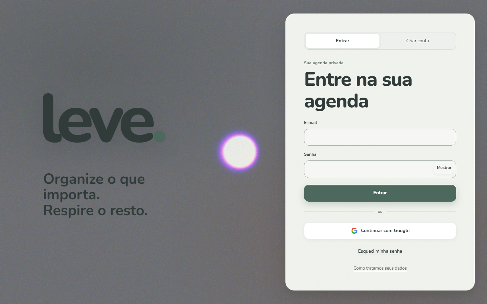
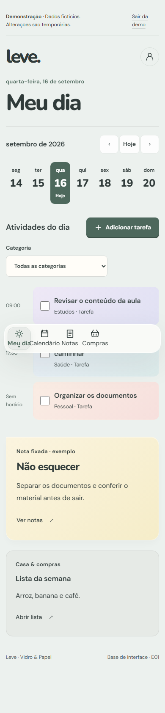
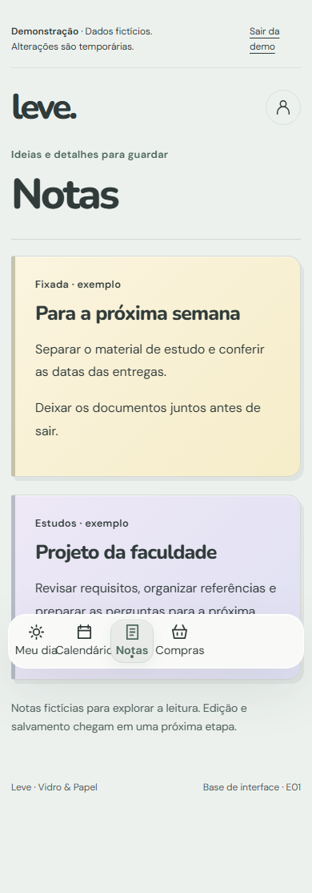
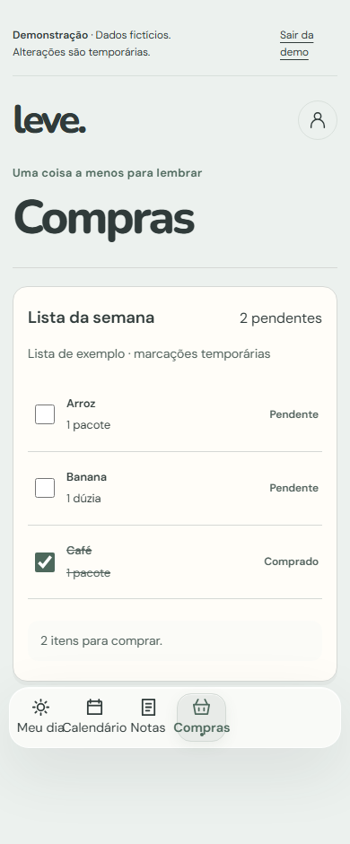

# Leve

Leve é uma agenda pessoal progressiva para organizar atividades, calendário, notas e compras em um único espaço privado. A interface foi desenhada para uso diário no celular e no desktop, com dados persistentes, sincronização autenticada e recuperação explícita em caso de conflito ou falha de rede.

**Status da entrega:** release final homologada e aceita pelo mantenedor. As validações em aparelho, instalação/atualização do PWA, notificações, acessibilidade manual, capacidade e rollback foram realizadas pelo responsável do projeto.

## Visão geral

- React, TypeScript e Vite no aplicativo web responsivo.
- Firebase Authentication e Firestore para identidade e dados privados por conta.
- API Express: toda mutação passa por `POST /api/commands` com token Firebase.
- PWA instalável, cache privado opt-in, outbox por aparelho e notificações configuráveis.
- Recorrência, lixeira, exportação/importação versionada e exclusão retomável.
- CORS configurável por `CORS_ORIGINS`; por padrão, a API aceita apenas o mesmo domínio.
- Logs estruturados com níveis (`debug`, `info`, `warn`, `error`), redação de segredos e `LOG_LEVEL` por ambiente.

## Preview

As imagens abaixo são geradas com `npm run screenshots`:



  

## Requisitos e execução

Node.js 24.x e npm 11.19.1. O campo `packageManager` fixa a versão; o CI habilita Corepack e verifica divergências.

```sh
corepack enable
npm ci
npm run dev
```

O comando local inicia Auth/Firestore Emulator, API e Vite. Para dados fictícios, execute `npm run seed:local` e abra `http://localhost:5174/entrar`. Arquivos `.env*` não são versionados.

### Uso offline

O modo offline é privado e opt-in. Ative-o em **Preferências → Aparelho → Uso offline** enquanto estiver conectado e abra as áreas que deseja consultar. A partir daí, uma sessão autenticada e os dados já carregados ficam disponíveis no aparelho sem internet; novas alterações são guardadas na outbox local e sincronizadas quando a conexão voltar. O primeiro acesso e a ativação do modo offline ainda precisam acontecer online.

## Verificação

```sh
npm run lint
npm run typecheck
npm run build
npm test
npm run test:integration
npm run test:e2e:local
```

`npm run check` encadeia build, testes unitários e E2E. Os testes usam emuladores e dados fictícios; push com aplicativo fechado, leitor de tela externo e instalação em aparelho físico exigem validação adicional.

## Estrutura

| Caminho | Responsabilidade |
| --- | --- |
| `apps/web/src/app` | Rotas, shell e providers |
| `apps/web/src/features` | Identidade, agenda, notas, compras e preferências |
| `apps/web/src/platform` | Firebase, API, tema, outbox e PWA |
| `server` | Comandos, autorização, repositórios e jobs |
| `packages/domain` | Schemas e regras compartilhadas |
| `workers/scheduler` | Tick HMAC gratuito |
| `tests` | Testes unitários, integração e navegador |
| `docs` | Decisões, runbooks e evidências resumidas |

## Segurança e operação

Dados são privados por UID e membership. O cliente não grava diretamente nas coleções de domínio. Comandos usam `operationId`, entidade estável e revisão esperada; conflitos preservam o conteúdo concorrente. Logs não devem conter tokens, cookies, senhas ou conteúdo privado.

Em produção, use `LOG_LEVEL=error` (ou `warn` para diagnóstico controlado). Em desenvolvimento, o padrão é `debug`. Nenhum recurso pago é ativado.

## Estado da entrega

A base cobre E00–E11 com testes automatizados, emuladores e homologação manual. A hospedagem autorizada está em `https://leve-agenda.vercel.app`. Consulte [CONTINUAR.md](CONTINUAR.md) para o histórico operacional.

## Privacidade e acessibilidade

O resumo público de privacidade está disponível em `/privacidade`. A conta permite exportar e excluir dados, revogar notificações, reduzir movimento, reduzir transparência e aumentar contraste. Estados de carregamento e perda de conexão informam o que está acontecendo e oferecem recuperação sem apagar alterações locais.

## Licença

Distribuído sob a licença MIT. Consulte [LICENSE](LICENSE).
