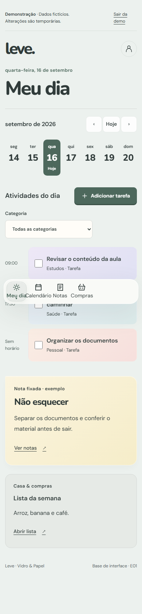
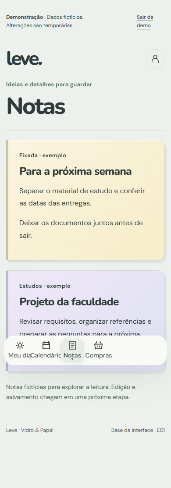
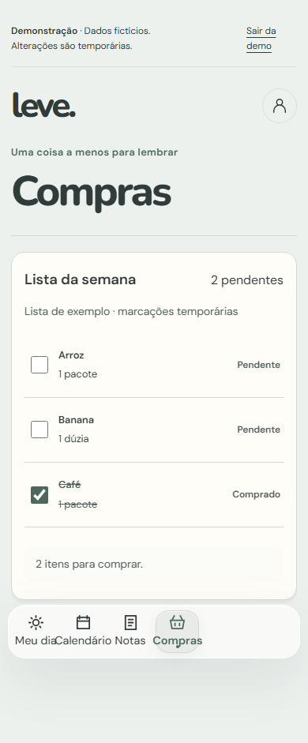

# Leve

Leve é uma agenda pessoal para organizar atividades, calendário, notas e listas de compras em um espaço privado, no celular e no computador.


<p align="center">
  
  
  
</p>

## O que você encontra

- Atividades com data, horário, recorrência, lembretes e calendário de mês, semana e dia.
- Notas, categorias, listas de compras, busca, lixeira e exportação ou importação dos dados.
- Aplicação web instalável (PWA) e uso offline opcional, com dados guardados no aparelho.
- Assistente Gika para consultar e organizar atividades com validação e confirmação pelas regras do Leve.

## Arquitetura em poucas linhas

A interface é uma aplicação React e TypeScript. Firebase Authentication identifica a conta; Firestore mantém os dados privados por usuário. O navegador lê as coleções permitidas pelas regras do Firestore e envia alterações à API Express em `POST /api/commands`. A API valida identidade, associação à conta, esquema e revisão antes de gravar. Um Worker agenda tarefas de manutenção e lembretes por uma rota assinada.

A Gika usa a API e as políticas do servidor. Ela não grava no banco nem substitui as telas convencionais da agenda. Consulte [arquitetura](docs/gika/ARCHITECTURE.md) e [decisões de engenharia](docs/adr/).

## Executar localmente

Requisitos: Node.js 24.x, npm 11.19.1 e Java 21 para o emulador Firestore. O projeto fixa a versão do npm em `package.json`.

```sh
corepack enable
npm ci --include=dev
npm run dev
```

O comando inicia os emuladores Auth e Firestore, a API local e a interface web. Em outro terminal, carregue dados fictícios:

```sh
npm run seed:local
```

Abra `http://localhost:5174/entrar`. O seed informa as credenciais de teste. Os emuladores não enviam e-mails reais; a tela de verificação oferece a confirmação local de teste.

## Comandos úteis

| Comando | Uso |
|---|---|
| `npm run dev` | Ambiente local com emuladores, API e web |
| `npm run seed:local` | Dados fictícios nos emuladores |
| `npm run lint` | ESLint e limites entre módulos |
| `npm run typecheck` | TypeScript do cliente e servidor |
| `npm run build` | Typecheck e build web |
| `npm test` | Testes unitários |
| `npm run test:integration` | Testes com Auth e Firestore Emulator |
| `npm run test:e2e:local` | Jornadas locais com Playwright |
| `npm run verify` | Auditoria de dependências e gates principais |

Veja [como contribuir](CONTRIBUTING.md), [documentação](docs/README.md), [segurança](SECURITY.md) e [licença MIT](LICENSE).
