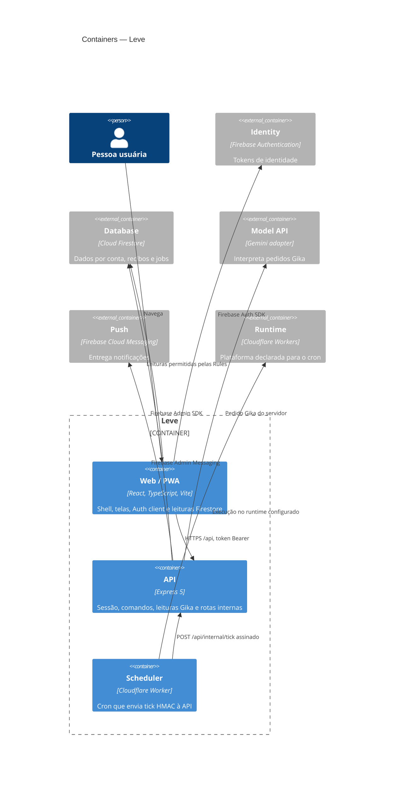

# Containers e componentes

## Containers (C4)

## Código associado

| Componente | Entradas principais | Implementação |
|---|---|---|
| Web / PWA | Rotas e eventos do browser | [App.tsx](../../apps/web/src/app/App.tsx), [firebase client](../../apps/web/src/platform/firebase.ts), [Service Worker](../../apps/web/public/sw.js) |
| API | `/api/*` | [Express app](../../server/app.ts), [Vercel adapter](../../api/index.ts), [servidor local](../../server/dev.ts) |
| Domínio compartilhado | Schemas e envelopes | [content.ts](../../packages/domain/src/content.ts), [identity.ts](../../packages/domain/src/identity.ts) |
| Persistência e comandos | Operações no servidor | [commands](../../server/commands/), [Firebase Admin](../../server/platform/firebase.ts) |
| Gika | Resolução, política e integração de modelo | [router](../../server/gika/router.ts), [reads](../../server/gika/reads.ts), [adapter Gemini](../../server/gika/gemini.ts) |
| Scheduler | Cron → rota interna | [Worker](../../workers/scheduler/src/index.js), [reminders.ts](../../server/reminders.ts) |

## Limites de responsabilidade

O browser lê apenas caminhos e operações permitidos por [firestore.rules](../../firestore.rules). A API usa Admin SDK para operações de domínio e tarefas privilegiadas; Admin SDK não herda as Rules. O Worker é código do sistema Leve hospedado/configurado para Cloudflare Workers: forma a assinatura e chama a API. O runtime do provedor é uma dependência externa, e o manifest não comprova implantação ativa. A API valida a assinatura e coordena as rotinas.

O mapeamento de endpoints e a diferença entre o servidor Express local e o adapter HTTP da Vercel estão em [runtime e deploy](deployment-runtime.md).
