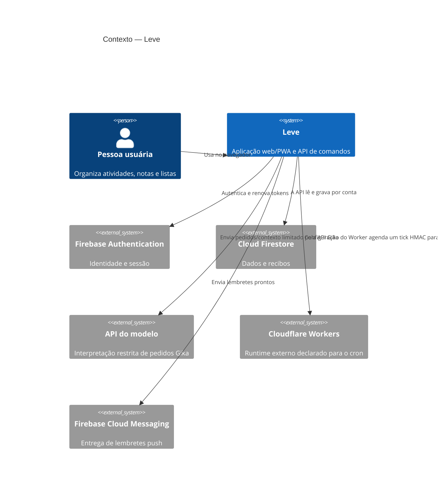

# Contexto do sistema

## Contexto (C4)

O Leve oferece uma agenda privada pela aplicação web instalável. A pessoa usa as telas convencionais ou a Gika; os serviços externos fornecem identidade, banco, modelo e entrega de lembretes.

O diagrama mostra integrações presentes no código. Não afirma que credenciais, domínios ou serviços estejam configurados ou implantados em um ambiente externo.

## Fronteiras principais

- O browser contém UI, Firebase Auth e SDK do Firestore para as leituras que as Rules permitem. A UI não grava diretamente nas coleções de domínio.
- A API Express valida o token recebido, resolve a conta pelo UID autenticado e processa comandos. O cliente não escolhe o UID da conta-alvo.
- O Admin SDK no servidor ignora as Firestore Rules. Cada leitor e escritor privilegiado precisa aplicar as verificações de identidade, associação e estado previstas no seu fluxo.
- O adaptador do modelo Gika recebe entrada e contexto limitado pelo servidor. O modelo não recebe cliente Firestore, credenciais ou acesso direto a comandos.
- O Worker mantido no repositório é um container do sistema Leve; a plataforma Cloudflare que o hospeda é externa. O Worker chama a rota interna assinada e não executa as regras do domínio no browser.

Detalhes: [containers](containers.md), [autorização](authentication-authorization.md), [Gika](gika.md) e [runtime/deploy](deployment-runtime.md).
