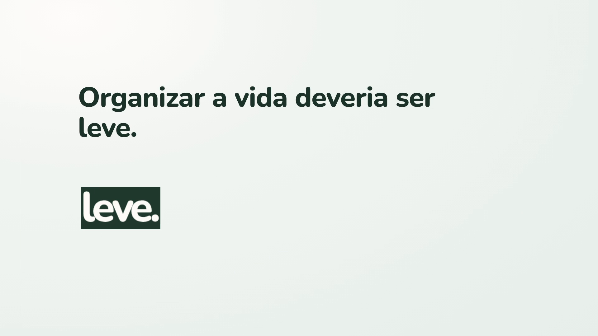

# Filme de produto do Leve — V2

72 segundos de UI real, motion editorial e trilha instrumental original. A narrativa continua compreensível sem áudio; não há voz gravada ou TTS. O SRT é texto editorial opcional, não transcrição de fala.

## Entregáveis

| Arquivo local | Uso |
|---|---|
| `output/leve-product-film.mp4` | Master 1920×1080, 60 fps, H.264 CRF17, yuv420p, BT.709, AAC estéreo 48 kHz |
| `output/leve-product-film-muted.mp4` | Mesmo stream de vídeo, sem áudio |
| `output/leve-product-film-readme.mp4` | Derivado 1280×720, sem áudio, abaixo de 10 MB; não avaliar qualidade do master por esta cópia |
| `output/poster.png` | Poster 1080p |
| `output/leve-product-film.srt` | Nove cues editoriais, 72 s |

O master V2 também é versionado para download direto: cerca de 12 MB, preservando CRF17/1080p60 e áudio. [Baixar master com áudio](output/leve-product-film.mp4). Stems, capturas e versão muted são locais e ignorados pelo Git. Código, relatórios, manifestos, poster, SRT e derivado compacto são versionados. V1 preservada localmente em `output/v1/` e nos relatórios com sufixo `-v1`.

## Reproduzir a pipeline existente

Requisitos: Node 24, npm 11, Chromium `/usr/bin/chromium`, FFmpeg, Python e Firebase Emulator. Dependências de captura já pertencem ao repositório; composição isolada em `remotion/`. Instale dependências de áudio com `python3 -m pip install -r video/audio/requirements.txt`.

1. Inicie o app local e Auth/Firestore Emulator com a fixture upstream existente em `capture/gemini-upstream-fixture.mjs`, conforme relatório de captura.
2. Gere V1 se ausente (a marca original é reaproveitada): `node video/capture/capture.mjs --run run-1`.
3. Gere V2: `node video/capture/capture.mjs --polish --run polish-1`; repita com `polish-2`.
4. Compare: `python3 video/capture/compare-runs.py polish-1 polish-2`.
5. Instale composição: `npm ci --prefix video/remotion`.
6. Sintetize música/stems/mix: `python3 video/audio/compose.py`.
7. Renderize: `npm run --prefix video/remotion render`.
8. Muxe áudio e gere derivados sem reencodar o vídeo master: `npm run --prefix video/remotion postprocess`.
9. Valide: `python3 video/scripts/verify`; faça decode integral e revisão visual conforme `reports/06-qa.md`.

## Honestidade da demonstração

Capturas usam conta e dados sintéticos no Emulator. Abertura: nota salva online antes da queda de conexão, permanecendo na página aberta; nenhuma edição/reload de nota offline. Trecho posterior: dados consultados, uma tarefa elegível na outbox e aplicação após ACK de reconexão. Sem promessa de disponibilidade universal ou sincronização de todas as operações.

Gika: só a chamada upstream Gemini é interceptada com envelope/function-call compatível. UI, autenticação, endpoint do app, router e comando são reais. Não é resposta gerada ao vivo; a interceptação fica documentada no relatório/ledger, sem linguagem técnica sobreposta ao filme conforme direção V2.

A divergência entre documentação do produto e comportamento default de cache/outbox permanece registrada. Produto não foi alterado para a filmagem.

## Relatórios e licenças

- `reports/07-polish-analysis.md`: análise anterior à edição.
- `reports/07-polish-report.md`: diferenças V1/V2 e entrega.
- `reports/06-qa.md`: QA da V2; V1 em `06-qa-v1.md`.
- `reports/claims-ledger.md`: afirmações e evidências.
- `ASSETS.md`, `audio/README.md`, `licenses/`: origem da música original MIT e fontes OFL.

Remotion 4.0.410 mantém os termos próprios da ferramenta; elegibilidade comercial conforme tamanho de equipe deve ser conferida pelo responsável pela distribuição. Avaliação objetiva de áudio inclui arranjo, sincronismo e níveis medidos, não audição subjetiva humana, indisponível neste ambiente.
